# 깃 / 깃허브 ~
* [01. 깃을 사용하는 이유 & 기본 셋팅](git을-왜-사용하는가)
* [02. 기본적인 명령어](기본-명령어)
* [03. branch](branch)


[뒤로](../../README.md)  


## Git을 왜 사용하는가?
    작업한 코드를 기록, 보관 가능
    과거로 되돌리기 가능.
    히스토리 보기 가능!
    범인찾기 가능!(-_-)


### 기본 셋팅
https://git-scm.com/

    여차저차! 설치를 하고~~

### 이메일 및 이름 등록
```
git config --global user.email myEmail.naver.com
git config --global user.name UserName
```


### 메인 브렌치 설정
```
git branch -M main
```
    

### 원격 Repository
    git이 파일 기록하는 장소 .git 폴더에서 관리함
    1. 컴퓨터가 고장나도 안전
    2. 협업에서 필수 
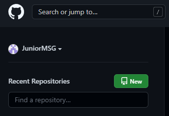
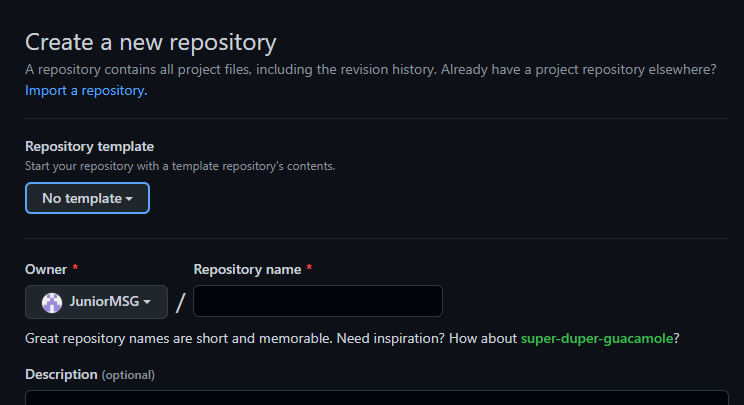
## 기본 명령어
    git add -> staging area -> git commit -> push -> repository 


### 상태보기 
    git status

### add
|기능|명령어|
|---|---|
|전체추가| git add .|
|파일추가| git add . app.txt|
|복수 파일 추가 |git add app.txt txt.txt|

### commit 
    git commit -m '수정본'

### add + commit
    git commit -a -m '수정본'

### push
```
git push -u 저장소주소 브랜치명
```


### 로그보기
    git log --all --oneline

### 기존 버전과 차이점 보기
    개인적으로 이건 불편해서 못쓰겠다.!..
    git diff
    git difftool
#### 툴을 이용하자. 
    git diff, git difftool은 보기 너무 불편해서..
    툴을 이용하는게 좋지 않을까?
    다양한 툴이 있고.. 툴을 사용하면 더 편하게 볼 수 있다.

#### PyCharm, Git
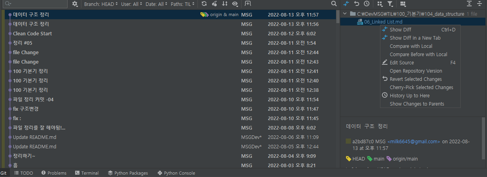
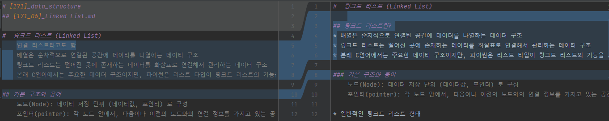

#### GitKraKen
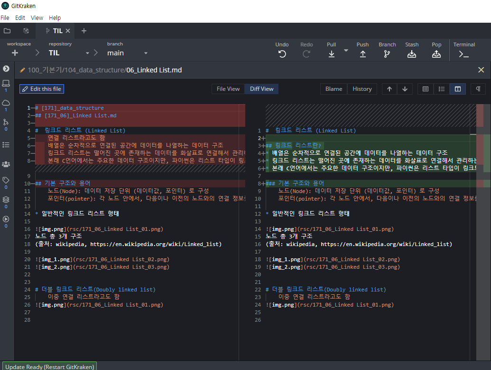

## branch
    기존 코드를 변경하지 않고 복사본을 만들고 작업한다고 생각하면 된다.

### 명령어
|기능|명령어|
|---|---|
|추가|git branch feature-#2|
|이동|git switch feature-#2|
|삭제|git branch -d feature-#2| 


#### 다른 툴에서 보기
    이렇게 나온다.
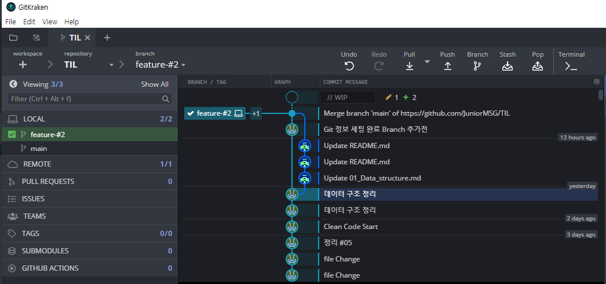

### 병렬로 진행 후
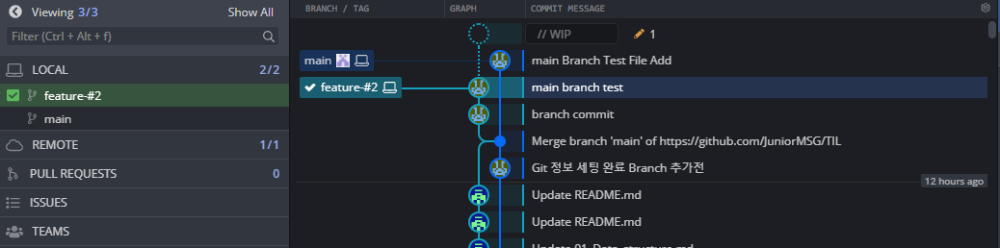

## Merge
    git branch main
    git merge feature-#2
    다른 파일 수정시 - 정상 엔딩
    같은 파일의 같을 줄 수정시 - 충돌 엔딩 (수동으로 해결해야 한다.)

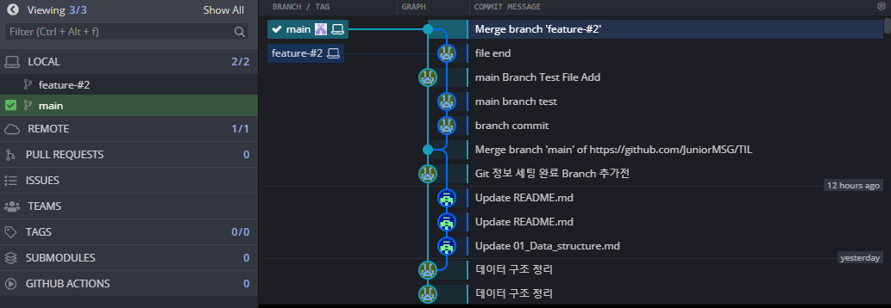

### 1. 3-way merge
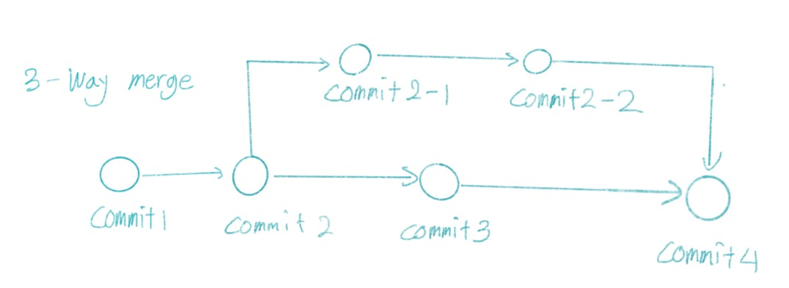
### 2. fast-forward merge

### 3. rebase & fast-forward merge
    git branch feature-#2
    git merge main
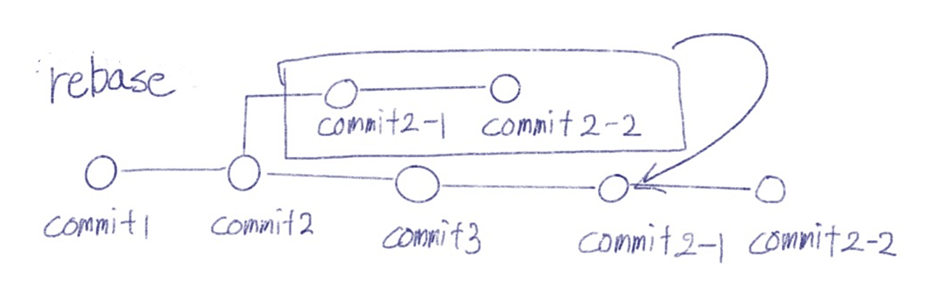


#### 사용이유
    3-way merge가 너무 많아지면 로그가 복잡하기 때문에..
    간단하고 짧은 브랜치들은 깔끔하게 정리 가능하다. 
    Conflict 가 자주 발생한다.

### 4. squash and merge
    git merge --squash 새브랜치
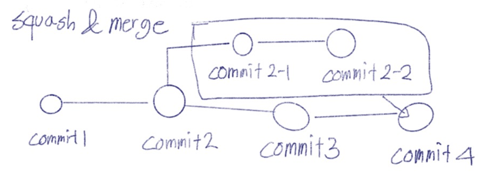
#### 사용이유
    로그가 복잡해지기 때문에 사용하는거고..
    간단하고 짧은 브랜치들은 깔끔하게 정리 가능하다. 

### 언제 사용하면 될까요
    가이드에 따라서 사용하면 된다.
    branching/merge 가이드
    안중요한 브랜치는 squash
    feature / develop 브랜치는 3-way merge

## 되돌리기
|기능|명령어|주의사항|
|---|---|---|
|최근 커밋시점으로 이동|git restore||
|특정 커밋시점으로 이동|git restore --source commitID||
|스테이징 취소|git restore --staged aaa.py||
|커밋 취소|git revert commitID1 commitID2||
|방금 커밋 취소|git revert HEAD||
|특정 시점으로 돌아가며 코드 전부 초기화 |git reset --hard commitID|협업시 사용금지|
|리셋인데 변동사항 지우지 말고 스테이징 상태|git reset --soft commitID||
|리셋인데 변동사항 지우지 말고 언스테이징 상태|git reset --mixed commitID||