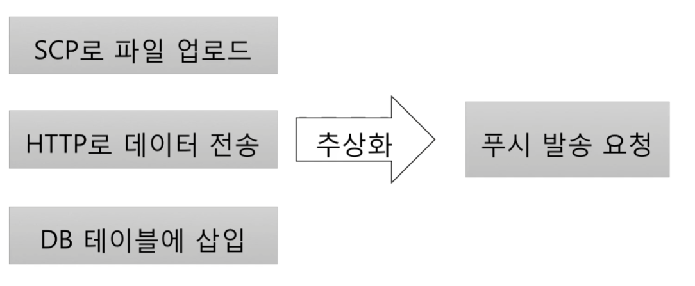

# 객체지향이란 무엇인가?

* [01. 절차 지향 vs 객체 지향](#1-절차-지향-vs-객체-지향)
* [02. 다형성(Polymorphism)이란?](#2-다형성이란)
* [03. 추상화(Abstraction)이란?](#3-추상화이란)

[뒤로](README.md)


## 1. 절차 지향 vs 객체 지향
### 절차지향

    데이터를 여러 프로시저가 공유하는 방식 

#### 비용

    요구사항이 추가 될 때마다 프로세스가 추가되며
    같은 소스가 여러곳에 산재하게 되고
    해당 요구사항이 추가수정 된다면 여러곳에 비슷한 소스가 존재하는 상황이 만들어지면
    점점 프로그램의 수정에 비용이 커지게 된다.

### 객체지향
    데이터 및 프로시저를 객체 단위로 묶는것

#### 객체의 핵심
  * 기능 제공
  * 객체는 제공하는 기능으로 정의
  * 내부적으로 가진 필드(데이터)로 정의하지 않음

#### 기능 명세

- 메서드(오퍼레이션)를 이용해서 기능 명세
    - 이름, 파라미터, 결과로 구성됨
- 객체와 객체는 기능을 사용해서 연결
- 기능 사용 = 메서드 호출

[뒤로](README.md) / [위로](#객체지향이란-무엇인가)


## 2. 다형성이란?
> 여러 (poly) 모습(morph)을 갖는 것  
> 객체 지향에서는 한 객체가 여러 타입을 갖는 것  
> 한 객체가 여러 타입의 기능을 제공   
> 타입 상속으로 다형성 구현 


```Java
  public class Timer {
    public void start(){ .. }
    public void stop() { .. }
  }
  public interface Rechargeable{
    void charge();
  }
  
```   

```Java
  public class TimerSeoul extends Timer implements Rechargeable {
   ... 
  }
  public void charge(){
   ...
  }
  TimerSeoul it = new TimerSeoul();
  it.start();
  it.stop();
  
  Timer t = it;
  t.start()
  t.stop()
  
  Rechargeable r = it;
  r.charge()
```

[뒤로](README.md) / [위로](#객체지향이란-무엇인가)

## 3. 추상화이란?
    데이터나 프로세스 등을 의미가 비슷한 개념이나
    의미 있는 표현으로 정의하는 과정

### 두 가지 방식의 추상화
    특정한 성질, 공통 성질(일반화)
    공통 성질을 뽑아내는 부분이 다형성과 관련있다.
    
|예시|항목|
|---|---|
|DB의 USER 테이블|아이디, 이름, 이메일|
|Money 클래스|통화, 금액|
|그래픽 카드|Geforce, AMD|
 
### 서로 다른 구현 추상화  


### 타입 추상화 
    여러 구현 클래스를 대표하는 상위 타입 도출
    흔히 인터페이스 타입으로 추상화
    추상화 타입과 구현은 타입 상속으로 연결



[뒤로](README.md) / [위로](#객체지향이란-무엇인가)