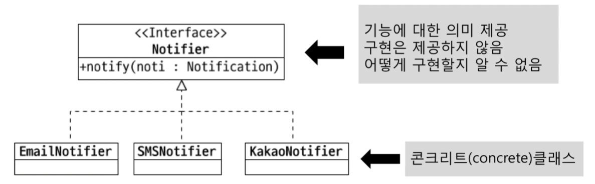
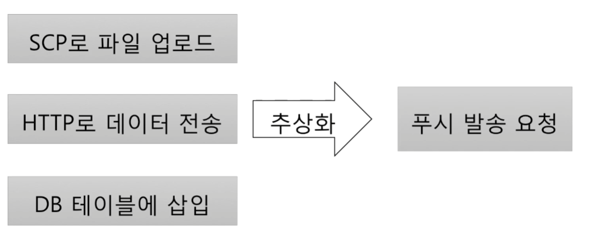

# 추상화(Abstraction)

## 추상화 (Abstraction)
    데이터나 프로세스 등을 의미가 비슷한 개념이나
    의미 있는 표현으로 정의하는 과정

### 두 가지 방식의 추상화
    특정한 성질, 공통 성질(일반화)
    공통 성질을 뽑아내는 부분이 다형성과 관련있다.
    
|예시|항목|
|---|---|
|DB의 USER 테이블|아이디, 이름, 이메일|
|Money 클래스|통화, 금액|
|그래픽 카드|Geforce, AMD|
 
### 서로 다른 구현 추상화  

### 타입 추상화 
    여러 구현 클래스를 대표하는 상위 타입 도출
    흔히 인터페이스 타입으로 추상화
    추상화 타입과 구현은 타입 상속으로 연결
