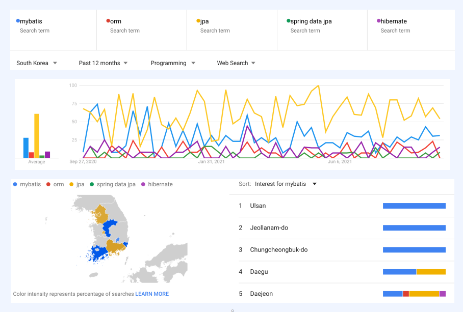
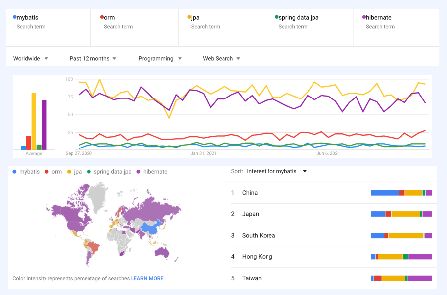

# ORM 이란 무엇인가?
* [01. ORM 이란 무엇인가? ](#orm-이란-무엇인가)
* [02. JPA ](#jpa-jakartajava-persistence-api)
* [03. 기존기술 ](#기존기술)

### Reference
[뒤로](../README.md) / [위로](#orm-이란-무엇인가)

## ORM 이란 무엇인가?
    ORM은 Object Relational Mapping 즉, 객체-관계 매핑의 줄임말이다.   
    객체-관계 매핑을 풀어서 설명하자면 우리가 OOP(Object Oriented Programming)에서 쓰이는 
    객체라는 개념을 구현한 클래스와 RDB(Relational DataBase)에서 쓰이는 
    데이터인 테이블 자동으로 매핑(연결)하는 것을 의미한다. 
    그러나 클래스와 테이블은 서로가 기존부터 호환가능성을 두고 만들어진 것이 아니기 때문에 불일치가 발생하는데, 
    이를 ORM을 통해 객체 간의 관계를 바탕으로 SQL문을 자동으로 생성하여 불일치를 해결한다. 
    따라서 ORM을 이용하면 따로 SQL문을 짤 필요없이 객체를 통해 간접적으로 데이터베이스를 조작할 수 있게 된다.

    객체 지향 언어를 이용하여, 서로 호환되지 않는 타입 간의 데이터를 변환하는 기술
    • 좁은 의미: DB(RDBMS) 테이블 데이터를 (자바) 객체와 매핑하는 기술
    • 효과: RDBMS를 객체 지향 DB로 가상화하는 것
    • ORM 으로 얻고자 하는 것
    • DB의 추상화: 특정 DB에 종속된 표현(ex: SQL)이나 구현이 사라지고, DB 변경에 좀 더 유연해짐
    • 객체의 이점을 활용: 객체간 참조, type-safety
    • 관심사 분리: DB 동작에 관한 코드 작성의 반복을 최소화하고 비즈니스 로직에 집중
    
### 장점
    객체 지향적인 코드로 인해 더 직관적이고 비즈니스 로직에 더 집중할 수 있게 도와준다.
    ORM을 이용하면 SQL Query가 아닌 직관적인 코드(메서드)로 데이터를 조작할 수 있어 
    개발자가 객체 모델로 프로그래밍하는 데 집중할 수 있도록 도와준다.  선언문, 할당, 종료 같은 부수적인 코드가 없거나 급격히 줄어든다.
    각종 객체에 대한 코드를 별도로 작성하기 때문에 코드의 가독성을 올려준다.
    SQL의 절차적이고 순차적인 접근이 아닌 객체 지향적인 접근으로 인해 생산성이 증가한다.
    재사용 및 유지보수의 편리성이 증가한다.
    ORM은 독립적으로 작성되어있고, 해당 객체들을 재활용 할 수 있다.
    때문에 모델에서 가공된 데이터를 컨트롤러에 의해 뷰와 합쳐지는 형태로 디자인 패턴을 견고하게 다지는데 유리하다.
    매핑정보가 명확하여, ERD를 보는 것에 대한 의존도를 낮출 수 있다.
    DBMS에 대한 종속성이 줄어든다.
    객체 간의 관계를 바탕으로 SQL을 자동으로 생성하기 때문에 RDBMS의 데이터 구조와 Java의 객체지향 모델 사이의 간격을 좁힐 수 있다.
    대부분 ORM 솔루션은 DB에 종속적이지 않다.
    종속적이지 않다는것은 구현 방법 뿐만아니라 많은 솔루션에서 자료형 타입까지 유효하다.
    프로그래머는 Object에 집중함으로 극단적으로 DBMS를 교체하는 거대한 작업에도 비교적 적은 리스크와 시간이 소요된다.
    또한 자바에서 가공할경우 equals, hashCode의 오버라이드 같은 자바의 기능을 이용할 수 있고, 간결하고 빠른 가공이 가능하다.

### 단점
    완벽한 ORM 으로만 서비스를 구현하기가 어렵다.
    사용하기는 편하지만 설계는 매우 신중하게 해야한다.
    프로젝트의 복잡성이 커질경우 난이도 또한 올라갈 수 있다.
    잘못 구현된 경우에 속도 저하 및 심각할 경우 일관성이 무너지는 문제점이 생길 수 있다.
    일부 자주 사용되는 대형 쿼리는 속도를 위해 SP를 쓰는등 별도의 튜닝이 필요한 경우가 있다.
    DBMS의 고유 기능을 이용하기 어렵다. (하지만 이건 단점으로만 볼 수 없다 : 특정 DBMS의 고유기능을 이용하면 이식성이 저하된다.)
    프로시저가 많은 시스템에선 ORM의 객체 지향적인 장점을 활용하기 어렵다.
    이미 프로시저가 많은 시스템에선 다시 객체로 바꿔야하며, 그 과정에서 생산성 저하나 리스크가 많이 발생할 수 있다.

### Reference
[뒤로](../README.md) / [위로](#orm-이란-무엇인가)

## JPA (Jakarta(Java) Persistence API)
    Jakarta(Java) Persistence API
    자바에서 ORM 기술을 사용해 RDBMS를 다루기 위한 인터페이스 표준 명세
    • API + JPQL + metadata (+ Criteria API)
    • 기본적으로 관계형 데이터베이스의 영속성(persistence)만을 규정
    • JPA 구현체 중에 다른 유형의 데이터베이스 모델을 지원하는 경우가 있지만, 원래 JPA 스펙과는 무관
    • 이름의 변화
    • Java Persistence API -> Jakarta Persistence API
    • 2017년 9월, 오라클이 Java EE 를 이클립스 재단으로 이관 -> 상표권 문제로 이름을 변경
    • Spring Boot: 2.2 부터 Jakarta EE 로 의존성이 변경됨
    • 현재: JPA 2.2.3 (패키지명은 아직 javax.persistence.*)
    • 미래: JPA 3.0 이 도입되면 패키지명이 완전히 jakarta.persistence.* 로 변경될 전망

### Persistence (영속성)
    프로세스가 만든 시스템의 상태가 종료된 후에도 사라지지 않는 특성
    • 구현 방법: 시스템의 상태를 데이터 저장소에 데이터로 저장한다.
    • 사라지는 데이터 - 주기억장치(휘발성 스토리지)에 저장된 데이터
    • 프로세스 메모리 안의 데이터 (변수, 상수, 객체, 함수 등)
    • 사라지지 않는 데이터 - 보조기억장치(비휘발성 스토리지)에 저장된 데이터
    • 하드디스크, SSD 에 기록된 데이터 (파일, 데이터베이스 등)
    • 영속성 프레임워크: 영속성을 관리하는 부분을 persistence layer 로 추상화하고, 이를 전담하는 프
    레임워크에게 관리를 위임
    • JPA 에서 persistence 란: 프로세스가 DB로부터 읽거나 DB에 저장한 정보의 특

### JPQL
    Jakarta(Java) Persistence Query Language
    플랫폼으로부터 독립적인 객체 지향 쿼리 언어
    • JPA 표준의 일부로 정의됨
    • RDBMS의 엔티티(Entity)를 다루는 쿼리를 만드는데 사용
    • SQL의 영향을 받아서 형식이 매우 유사
  
    • SQL 과 JPQL 은 다른 언어이다.
    • SQL: 표준 ANSI SQL 을 기준으로 만든, 특정 DB에 종속적인 언어
    • JPQL: 특정 DB에 종속적인 언어가 아님
    • JPA 프레임워크를 사용한다면
    • 특별한 요구사항이 있지 않은 한, JPQL 을 몰라도 된다
    • JPQL을 직접 코드에서 사용하고 있다면, 반드시 필요했던 일인지 검토하기

### Reference
• https://en.wikipedia.org/wiki/Object%E2%80%93relational_mapping  
• https://docs.oracle.com/javaee/7/tutorial/persistence-intro.htm  
• https://en.wikipedia.org/wiki/Persistence_(computer_science)  
• https://en.wikipedia.org/wiki/Jakarta_Persistence_Query_Language

[뒤로](../README.md) / [위로](#orm-이란-무엇인가)

## 기존기술
### iBATIS, MyBatis, JbdcTemplate
    SQL Mapper
    RDBMS 쿼리문의 실행 결과를 자바 코드에 매핑하는 프레임워크
    • JDBC API 를 사용
    • persistence framework
    • 프로그램 코드와 SQL 을 분리

### iBATIS
    Apache iBATIS
    SQL 데이터베이스와 객체 간 매핑을 지원해주는 persistence framework
    • 지원 언어: Java, .NET, Ruby
    • SQL 문을 별도의 XML 문서로 작성하여 프로그램 코드와 분리한 형식
    • 2001년 Clinton Begin 이 개발
    • 2004년 iBATIS 2.0 릴리즈 - 아파치 소프트웨어 재단에 기증, 아파치에서 6년간 운영됨
    • 2010년 iBATIS 3.0 릴리즈 - MyBatis로 개발 프로젝트 이동, 아파치 애틱(Attic) 프로젝트로 분류됨
    • DAO 패턴이 발전하던 시기
    • Data Access Object 패턴: 애플리케이션 비즈니스 레이어와 영속성 레이어를 추상화된 API를 이
    용하여 분리
    • DB 접근 구현 클래스를 ~~~Dao 라고 네이밍하는 관례가 많았던 시기

### MyBatis
    MyBatis
    • iBATIS 3.0 에서 출발한 persistence framework (iBATIS 랑 비교할 필요 없이 이거 쓰면 됨)
    • 아직 쌩쌩히 살아있는 프로젝트
    • 스프링, 스프링 부트와 연동을 지원
    • 스프링: org.mybatis:mybatis-spring
    • 스프링 부트: org.mybatis.spring.boot:mybatis-spring-boot-starter
    • 다양한 프레임워크와 연동을 지원
    • Freemarker, Velocity, Hazelcast, Memcached, Redis, Ignite, Guice
    • ORM vs. MyBatis
    • ORM: 자바 객체를 DB 테이블과 매핑
    • MyBatis: 자바 메소드를 SQL 실행 결과와 매핑

### Reference
• https://en.wikipedia.org/wiki/Object%E2%80%93relational_mapping  
• https://docs.oracle.com/javaee/7/tutorial/persistence-intro.htm  
• https://en.wikipedia.org/wiki/Persistence_(computer_science)  
• https://en.wikipedia.org/wiki/Jakarta_Persistence_Query_Language

[뒤로](../README.md) / [위로](#orm-이란-무엇인가)