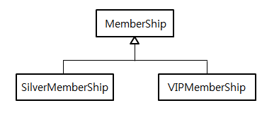
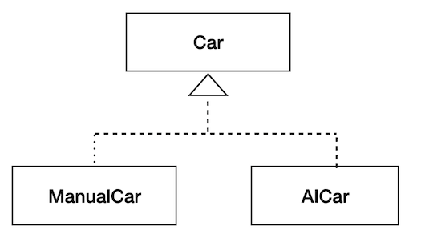

# 객체지향이란 무엇인가?

* [01. 객체 지향 프로그래밍이란 무엇인가?](#1-객체-지향-프로그래밍이란-무엇인가)
* [02. 객체지향의 특징](#2-객체지향의-특징)
* [03. 객체지향 설계](#3-객체지향-설계)
* [04. 객체지향 설계 : 클래스 다이어그램](#4-클래스-다이어그램)

[뒤로](README.md)


## 01. 객체 지향 프로그래밍이란 무엇인가?
    객체 지향 프로그래밍 이전의 프로그래밍 패러다임을 살펴보면, 중심이 컴퓨터에 있었다. 컴퓨터가 사고하는대로 프로그래밍을 하는 것이다. 
    객체지향 프로그래밍이란 인간 중심적 프로그래밍 패러다임이라고 할 수 있다. 
    현실 세계의 사물들을 객체라고 보고 그 객체로부터 개발하고자 하는 애플리케이션에 필요한 특징들을 뽑아와 프로그래밍 하는 것이다.

### 절차 지향 vs 객체 지향
### 절차지향
    데이터를 여러 프로시저가 공유하는 방식
#### 특징
* 요구사항이 추가 될 때마다 프로세스가 추가되며
* 같은 소스가 여러곳에 산재하게 되고
* 해당 요구사항이 추가수정 된다면 여러곳에 비슷한 소스가 존재하는 상황이 만들어지면
* 점점 프로그램의 수정에 비용이 커지게 된다.

### 객체지향
    데이터 및 프로시저를 객체 단위로 묶는것

#### 특징
  * 기능 제공
  * 객체는 제공하는 기능으로 정의
  * 내부적으로 가진 필드(데이터)로 정의하지 않음

#### 기능 명세
- 메서드(오퍼레이션)를 이용해서 기능 명세
    - 이름, 파라미터, 결과로 구성됨
- 객체와 객체는 기능을 사용해서 연결
- 기능 사용 = 메서드 호출

[뒤로](README.md) / [위로](#객체지향이란-무엇인가)


## 02. 객체지향의 특징
### 02_01. 추상화
    데이터나 프로세스 등을 의미가 비슷한 개념이나 의미 있는 표현으로 정의하는 과정
- 어떤 영역에서 필요로 하는 속성이나 기능을 추출하는 작업
- 데이터 구조, 표현방법에 대한 추상화
- 처리 과정에 대한 추상화

#### 두 가지 방식의 추상화
    특정한 성질, 공통 성질(일반화)
    공통 성질을 뽑아내는 부분이 다형성과 관련있다.
|예시|항목|
|---|---|
|DB의 USER 테이블|아이디, 이름, 이메일|
|Money 클래스|통화, 금액|
|그래픽 카드|Geforce, AMD|
 
### 서로 다른 구현 추상화  


### 타입 추상화 
    여러 구현 클래스를 대표하는 상위 타입 도출
    흔히 인터페이스 타입으로 추상화
    추상화 타입과 구현은 타입 상속으로 연결


### 02_02. 캡슐화
- 데이터를 감싸서 외부에서 사용 가능한 부분만을 제공 (Infomation hiding)
- 사용하는 코드(클라이언트 코드)가 세부적인 사항을 알 필요가 없음
- 단순한 접근을 제공하여 오류가 생길 부분을 감소함

### 02_03. 상속성
- 일반적인(general) 개념의 객체에서 보다 구체적인(specific) 개념의 객체의 관계를 표현
- 상속관계의 클래스는 상위 클래스의 타입을 내포함
- 상위 클래스의 속성과 기능을 하위 클래스에서 사용하거나 재정의 할 수 있음

### 02_04. 다형성 (polymorphism)
- 같은 메세지, 같은 구현에 대해 각 객체가 다른 표현과 결과를 나타내는 것
- 클래스의 상속, 인터페이스의 구현 시에 각각의 다른 구현을 가진 클래스들이 상위 타입으로 업캐스팅이 되고
 이 때, 각 클래스에서 오버라이딩한 메서드가 존재하는 경우 같은 상위 타입으로 선언된다 하더라도 각기 다른 인스턴스의 메서드가 호출되는것
```Java
  public class Timer {
    public void start(){ .. }
    public void stop() { .. }
  }
  public interface Rechargeable{
    void charge();
  }
  
```   

```Java
  public class TimerSeoul extends Timer implements Rechargeable {
   ... 
  }
  public void charge(){
   ...
  }
  TimerSeoul it = new TimerSeoul();
  it.start();
  it.stop();
  
  Timer t = it;
  t.start()
  t.stop()
  
  Rechargeable r = it;
  r.charge()
```
#### 오버로딩
    같은 이름의 함수(메서드)를 여러개 정의하고, 매개변수의 유형과 개수를 다르게하여 다양한 유형의 호출에 응답
#### 오버라이딩 
    상위 클래스가 가지고 있는 멤버변수가 하위 클래스로 상속되는 것처럼 상위 클래스가 가지고 있는 메서드도 하위 클래스로 상속되어 하위 클래스에 사용할 수 있습니다. 
    또한, 하위 클래스에서 메서드를 재정의해서도 사용할 수 있습니다. 
    쉽게 말해 메서드의 이름이 서로 같고, 매개변수가 같고, 반환형이 같을 경우에 상속받은 메서드를 덮어쓴다고 생각하시면 됩니다. 
    
[뒤로](README.md) / [위로](#객체지향이란-무엇인가)


## 03. 객체 지향 설계
- Design Heuristics  
  **Abstract class vs. Concrete Class**  (추상 클래스 vs 구체적인 클래스)  
  **Class Inheritance vs. Object Composition**  (재사용적 측면 상속 vs 합성) 보통은 합성을 사용한다.  
  **Interface Inheritance vs, Implementation Inheritance Etc...**  

### 응집도(cohesion)와 결합도(coupling)
- 잘 만들어진 소프트웨어는 응집도는 높고 결합도는 낮아야 함

**응집도**
- 하나의 모듈, 객체 내부의 요소들간의 연관성
- 하나의 책임을 구현하는 하나의 객체는 높은 응집도를 가짐

**결합도**
- 객체 상호관의 연관 관계
- 결합도가 높으면 하나의 객체를 수정할 때 다른 객체도 수정해야 함
- 상속은 클래스간의 결합도를 높히기 때문에 조심

### SOLID 원칙
#### 1. 단일 책임 원칙 (Single Responsibility Principle)
    DAO는 DB에 연결해서 데이터를 가져오는 역할만 하도록 만들어라 안에 이상한거 만들어서 다른 이유로 수정 되면 안된다.
- 하나의 클래스는 하나의 기능만을 구현하도록 한다. 즉, 어떤 클래스를 변경하는 이유는 하나이어야 한다
- 한 클래스에서 여러 기능을 제공하게 되면 유지보수가 어려움 

#### 2. 개방 폐쇄의 원칙 (Oepn-Closed Principle)
    JDBC - 다양한 데이터베이스 (Oracle, Mysql, Etc ... ) JDBC는 interface, connection, statement등에 대한 인터페이스를 
    서드파티사 (Oracle, Mysql, Etc ... )에서 구현하게 된다.
- 객체 자신의 수정에 대해서는 유연하고, 다른 클래스가 수정될 때는 영향을 받지 않는다.
- 인터페이스나 추상클래스를 통해 접근 하도록 함
- 예) 자바 JDBC, I/O Stream

#### 3. 리스코프 치환 원칙 (Liskov Subsititution Principle)
- 하위 클래스는 항상 상위 클래스로 교체 될 수 있어야 한다.
- 즉, 상위 클래스에 제공되는 여러 기능은 하위 클래스가 모두 사용가능 해야 한다.
- IS-A 관게, "is a kind of" 관계 

#### 4. 의존 역전 원칙 (Dependency Inversion Principle)
    주문을 하는 클래스(A)가 있다. 주문을 받는아서 배송하는 클래스(B)가 있다.
    A클래스에선 배송 방법을 선택해야 한다.
    B클래스는 다양한 배송(트럭, 비행기, 배, 오토바이) 등을 제공한다.
    해당 경우에 A클래스는 B클래스의 운송 수단을 알 필요가 없다.(추상적인 개념으로 배송만 중요할 뿐)
    B클래스 배송방법을 내부적으로 알아서 잘 관리하면 된다.
- 의존 관계는 구체적인 것보다는 추상적인 것에 의존한다.
- 구체적인 것은 이미 구현이 되어있고 변하기 쉬운것
- 추상적인 것은 인터페이스나 추상 클래스(상위 클래스)


#### 5. 인터페이스 분리 원칙 (Interface Segregation Principle)
- 제공하는 기능에 대한 인터페이스에만 종속적이어야 함
- 만약 하나의 객체가 여러 기능을 제공해야 한다면 ( 단일 책임 원칙에 위배 ) 이때 클라이언트가 사용할 수 있는 여러 인터페이스로 분리하여
  제공하면 클라이언트가 사용하지 않는 기능에 종속적이지 않을 수 있음


[뒤로](README.md) / [위로](#객체지향이란-무엇인가)

## 04. 클래스 다이어그램
- 객체 지향 프로그래밍에서 여러 클래스 상호관의 혐력 관계를 나타내는 Diagram
- 클래스 간의 관계를 설계 할때 유용함


### 연관 관계 (association)
- 클래스 상호 간에 서로 연관되어 있음을 나타냄
- 단방향 연관관계의 경우는 화살표(->)로 표시한다.
- 양방향 연관관계는 직선(-)으로 표시한다.
- 클래스간의 연관된 개체의 수를 표현해야 하는 경우에는 선의 끝쪽에 다중성(multiplicity)를 나타낸다.

```java
public class Student {
	int studentID;
	String studentName;
	ArrayList<Subject> subjectList;
}
```


### 집합 관계 (composition, aggregation)

- 연관관계의 특별한 경우
- 클래스간의 포함관계를 나타냄
- 전체 객체와 부분 객체의 인스턴스 생존 주기( life time ) 에 따라 두가지로 구분할 수 있음

**집약 관계**

- 클래스 다이어그램에 빈 마름모로 표시
- 전체 객체와 부분 객체의 라이프 타임이 독립적 즉, 포함하는 객체(전체 객체)가 사라져도 포함된 객체 (부분 객체)는 사라지지 않음
- 공유하는 리소스가 해당됨
- 전체 객체가 생성될 때 매개 변수로 전달 받음

**합성 관계**

- 클래스 다이어그램에 채워진 마름모로 표시
- 전체 객체의 라이프 타임에 부분객체가 종속됨. 전체 객체가 사라지면 부분 객체도 사라짐
- 주로 멤버 변수로 선언하여 사용
- 전체 객체의 생성자에서 부분 객체를 생성함

### 의존 관계 (dependency)

- 연관 관계 보다는 짧은 life time
- 프로그램 내에서는 참조 변수가 매개변수나 지역 변수로 구현

```
class Student {

    int money;
...
    public void takeBus(Bus bus) {
		  bus.take(1000);
		  this.money -= 1000;
		  
	 }
	    
	public void takeSubway(Subway subway) {
		  subway.take(1500);
		  this.money -= 1500;
	 }
}
```


### 일반화 관계 (generalization)
- 객체 지향에서 상속을 표현할 때
- 일반적인 클래스(상위 클래스)를 보다 구체적인 클래스(하위 클래스)가 상속함


### 실체화 관계 ( realization )

- 기능이 선언된 인터페이스를 구현하는 클래스는 선언된 기능을 구현할 책임이 있음
- 여러 클래스가 하나의 인터페이스를 구현함으로써 다형성을 제공함


### 접근 제어자 표시
| 접근제어자 | 표시 | 설명 |
| ------ | ------ |------ |
| public | + | 내부, 외부 모드 접근 가능 |
| protected | * | 같은 패키지나 상속관계의 클래스만 접근 가능 |
| default | ~ | 같은 패키지만 접근 가능 |
| private | - | 같은 클래스 내부에서만 접근 가능 |


[뒤로](README.md) / [위로](#객체지향이란-무엇인가)