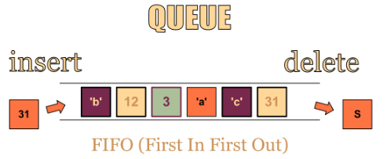
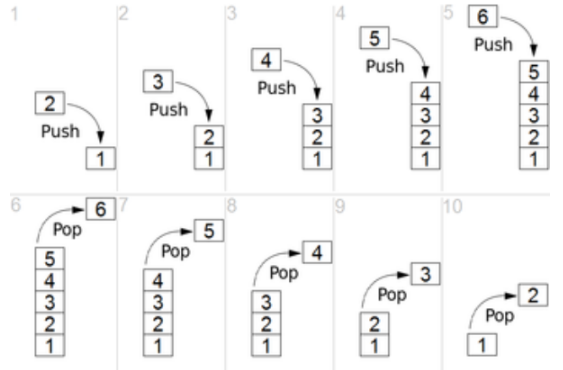

# data_structure
* [01. 데이터 구조란?](#1-데이터-구조)
* [02. 대표적인 자료구조 배열(Array)](#2-배열array)
* [03. Queues](#3-queues)  
* [04. Stacks](#4-stacks)  

[뒤로](README.md) / [위로](#data_structure)

## 1. 데이터 구조
### 데이터 구조란?
    자료구조, 데이터 구조, Data structure 라고 쓴다.
    대량의 데이터를 효율적으로 관리할 수 있는 데이터의 구조를 뜻하며 
    코드상에서 효율적으로 데이터를 처리하기 위해, 데이터 특성에 따라, 체계적으로 데이터를 구조화한다.
    어떤 데이터 구조를 사용하느냐에 따라, 코드 효율이 달라짐

### 데이터를 어떻게 하느냐에 따라서 속도에 영향을 준다.
    어떠한 작업에 어떠한 데이터 구조를 언제, 어떻게 쓰는지 아는 것이 해당 어플리케이션의 속도에 영향을 준다.
    1. 검색
    2. 읽기 
    3. 삽입
    4. 삭제

### 효율적으로 데이터를 관리하는 예
    우편번호: 5자리 우편번호로 국가의 기초구역을 제공
    5자리 우편번호에서 앞 3자리는 시, 군, 자치구를 표기, 뒤 2자리는 일련번호로 구성

### 대표적인 자료구조
    배열, 스택, 큐, 링크드 리스트, 해쉬 테이블, 힙 등

### Reference
1. [노마드 코더 - 개발자라면 무조건 알고리즘 공부를 해야할까?](https://www.youtube.com/watch?v=9TyyMtlk5i4)

[뒤로](README.md) / [위로](#data_structure)

## 2. 배열(Array)
### 배열이란?
    1. 데이터를 나열하고, 각 데이터를 인덱스에 대응하도록 구성한 데이터 구조
    2. 파이썬에서는 리스트 타입이 배열 기능을 제공하고 있음

### 배열을 사용하는 이유 
    1. 같은 종류의 데이터를 효율적으로 관리하기 위해 사용
    2. 같은 종류의 데이터를 순차적으로 저장

#### 장점
    1. 데이터를 읽을때 빠르게 읽을 수 있다.

#### 단점
    1. 배열의 크기를 미리 선언해야한다. (파이썬은 거의 ArrayList랑 비슷해서 크게 상관없다)
    2. 검색 / 추가 / 삭제가 쉽지 않고 느리다.

#### Memory 관점에서
    READ : 인덱스로 읽으므로 매우 빠르다.
    Search : 전체를 검사해야 한다. (느리다)
        Best-Case : 데이터가 배열 앞부분에 있을 경우
        Comm-Case : 데이터가 배열 중간에 있을 경우
        Bad-Case  : 데이터가 배열에 끝에 있을 경우
        Worst-Case: 데이터가 없을 경우 
    Insert : 
        Best-Case : 배열 끝에 추가할 때 
        Comm-Case : 배열 중간에 추가할 때
        Bad-Case  : 배열에 앞에 추가할 때
        Worst-Case: 배열이 꽉차서 복사하고 추가할 때 
    DELETE : Insert랑 비슷함.
        Best-Case : 배열 끝에 추가할 때 
        Comm-Case : 배열 중간에 추가할 때
        Bad-Case  : 배열 앞에 추가할 때
        Worst-Case: 배열이 꽉차서 복사하고 추가할 때 

```python
data = [1,2,3,4,5]
print(data)

data = [[1, 2, 3] , [4, 5, 6], [7, 8 ,9]]
print(data)
print(data[0][0])
print(data[1][1])
# 다음 dataset에서 전체 이름 안에 M이 몇번 나왔는지 빈도수 출력

dataset = ['Braund, Mr. Owen Harris',
'Cumings, Mrs. John Bradley (Florence Briggs Thayer)',
'Heikkinen, Miss. Laina',
'Futrelle, Mrs. Jacques Heath (Lily May Peel)']
m_count = 0
for data in dataset:
    for index in range(len(data)):
        if data[index] == 'M':
            m_count += 1
print (m_count)
```
### Reference
1. [노마드 코더 - Array 배열 기초 개념](https://www.youtube.com/watch?v=NFETSCJON2M)

[뒤로](README.md) / [위로](#data_structure)

## 3. Queues
### Queues란?
    1. 큐는 일종의 규칙이다.
    2. 추상적 자료구조 (ADT - Abstract Data Type)이다.
    3. FIFO(First-In, First-Out) 또는 LILO(Last-In, Last-Out) 방식 / 가장 먼저 넣은 데이터를 가장 먼저 꺼낼 수 있는 구조

#### ADT (Abstract Data Type)
    자료구조가 행동 양식만 정의된 것
    규칙만 이해한다면 해당 자료구조를 만들 수 있다.

### 어디에 큐가 많이 쓰일까?
    멀티 태스킹을 위한 프로세스 스케쥴링 방식을 구현하기 위해 많이 사용됨 (운영체제 참조)
    큐의 경우에는 장단점 보다는 (특별히 언급되는 장단점이 없음), 
    큐의 활용 예로 프로세스 스케쥴링 방식을 함께 이해해두는 것이 좋음

### 예시
    1. 이메일 처리
    2. 줄을 서는 행위와 유사 현실이랑 비슷 함 (새치기는 없지만!)



### 용어
    Enqueue: 큐에 데이터를 넣는 기능
    Dequeue: 큐에서 데이터를 꺼내는 기능
    Visualgo 사이트에서 시연해보며 이해하기 (enqueue/dequeue 만 클릭해보며): 
    https://visualgo.net/en/list

### 파이썬 queue 라이브러리 활용해서 큐 자료 구조 사용하기¶
    queue 라이브러리에는 다양한 큐 구조로 Queue(), LifoQueue(), PriorityQueue() 제공
    프로그램을 작성할 때 프로그램에 따라 적합한 자료 구조를 사용
    Queue(): 가장 일반적인 큐 자료 구조
    LifoQueue(): 나중에 입력된 데이터가 먼저 출력되는 구조 (스택 구조라고 보면 됨)
    PriorityQueue(): 데이터마다 우선순위를 넣어서, 우선순위가 높은 순으로 데이터 출력


### Reference
1. [노마드코더 - 스택과 큐 간단한 영상](https://www.youtube.com/watch?v=Nk_dGScimz8&list=PL7jH19IHhOLMdHvl3KBfFI70r9P0lkJwL&index=7)
2. [구현코드](03_Queue.py)
[뒤로](README.md) / [위로](#data_structure)


## 4. Stacks
### Stacks이란?
    1. 스택은 일종의 규칙이다.
    2. 추상적 자료구조 (ADT - Abstract Data Type)이다.
    3. LIFO(Last In First Out) 구조  / 한쪽 끝에서만 자료를 넣거나 뺄 수 있는 구조
    4. 데이터를 제한적으로 접근할 수 있는 구조다.
    5. 스택 구조는 프로세스 실행 구조의 가장 기본이다. 함수 호출시 프로세스 실행 구조가 보통 스택




#### 예시
    1. 웹 브라우저의 뒤로가기
    2. Ctrl + Z 단축키 등등 
    3. 컴퓨터 내부의 프로세스 구조의 함수 동작 방식

#### 주요 기능
    push(): 데이터를 스택에 넣기
    pop(): 데이터를 스택에서 꺼내기

### 스택 구조
    스택은 LIFO(Last In, Fisrt Out) 또는 FILO(First In, Last Out) 데이터 관리 방식을 따름
    LIFO: 마지막에 넣은 데이터를 가장 먼저 추출하는 데이터 관리 정책
    FILO: 처음에 넣은 데이터를 가장 마지막에 추출하는 데이터 관리 정책

### 스택의 장단점
#### 장점
    구조가 단순해서, 구현이 쉽다.
    데이터 저장/읽기 속도가 빠르다.
#### 단점 (일반적인 스택 구현시)
    데이터 최대 갯수를 미리 정해야 한다.
    파이썬의 경우 재귀 함수는 1000번까지만 호출이 가능함
    저장 공간의 낭비가 발생할 수 있음
    미리 최대 갯수만큼 저장 공간을 확보해야 함
    스택은 단순하고 빠른 성능을 위해 사용되므로, 보통 배열 구조를 활용해서 구현하는 것이 일반적임. 이 경우, 위에서 열거한 단점이 있을 수 있음

### Reference
1. [노마드코더 - 스택과 큐 간단한 영상](https://www.youtube.com/watch?v=Nk_dGScimz8&list=PL7jH19IHhOLMdHvl3KBfFI70r9P0lkJwL&index=7)
2. [구현코드](04_Stack.py)
[뒤로](README.md) / [위로](#data_structure)


## 05.
### Reference
1. [노마드코더 - 스택과 큐 간단한 영상](https://www.youtube.com/watch?v=Nk_dGScimz8&list=PL7jH19IHhOLMdHvl3KBfFI70r9P0lkJwL&index=7)
2. [구현코드](04_Stack.py)
[뒤로](README.md) / [위로](#data_structure)

