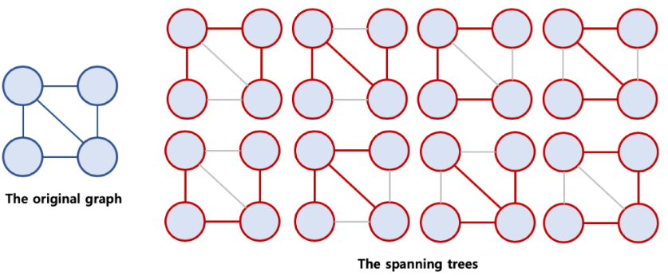
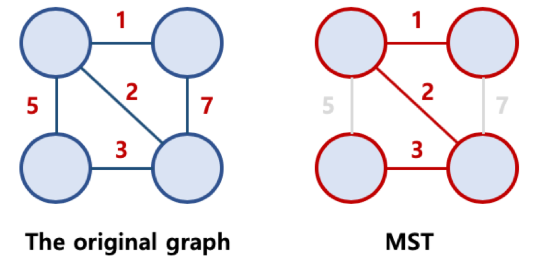
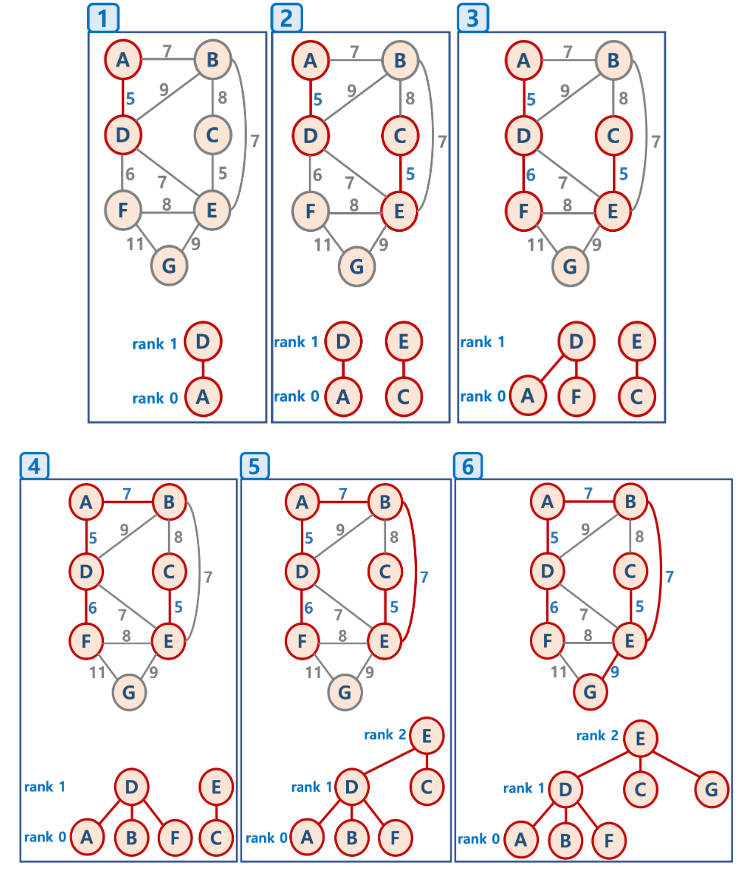

# 최소 신장 트리
* [01. 신장 트리란?](#1-신장-트리란?)
* [02. 크루스칼 알고리즘](#2-크루스칼-알고리즘)
* [03. ](#3)

> 참고

[뒤로](../README.md)

## 1. 신장 트리란?
- Spanning Tree, 또는 신장 트리 라고 불리움 (Spanning Tree가 보다 자연스러워 보임)
- 원래의 그래프의 모든 노드가 연결되어 있으면서 트리의 속성을 만족하는 그래프
- 신장 트리의 조건
  - 본래의 그래프의 모든 노드를 포함해야 함
  - 모든 노드가 서로 연결
  - 트리의 속성을 만족시킴 (사이클이 존재하지 않음)
  

### 1_1. 최소 신장 트리 
- Minimum Spanning Tree, MST 라고 불리움
- 가능한 Spanning Tree 중에서, 간선의 가중치 합이 최소인 Spanning Tree를 지칭함

### 1_2. 최소 신장 트리 알고리즘
- 그래프에서 최소 신장 트리를 찾을 수 있는 알고리즘이 존재함
- 대표적인 최소 신장 트리 알고리즘
  - Kruskal’s algorithm (크루스칼 알고리즘), Prim's algorithm (프림 알고리즘)

## 2. 크루스칼 알고리즘 (Kruskal's algorithm)
1. 모든 정점을 독립적인 집합으로 만든다.
2. 모든 간선을 비용을 기준으로 정렬하고, 비용이 작은 간선부터 양 끝의 두 정점을 비교한다.
3. 두 정점의 최상위 정점을 확인하고, 서로 다를 경우 두 정점을 연결한다. (최소 신장 트리는 사이클이 없으므로, 사이클이 생기지 않도록 하는 것임)

> 탐욕 알고리즘을 기초로 하고 있음 (당장 눈 앞의 최소 비용을 선택해서, 결과적으로 최적의 솔루션을 찾음)
> 

