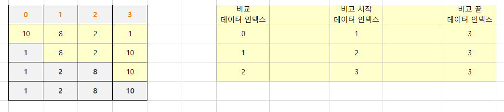

# 170_data_structure and etc
## 172_04_selection_sort.md


### 선택 정렬 (selection sort) 란?
* 다음과 같은 순서를 반복하며 정렬하는 알고리즘
  1. 주어진 데이터 중, 최소값을 찾음
  2. 해당 최소값을 데이터 맨 앞에 위치한 값과 교체함
  3. 맨 앞의 위치를 뺀 나머지 데이터를 동일한 방법으로 반복함

#### https://visualgo.net/en/sorting


출처: https://en.wikipedia.org/wiki/Selection_sort
    


### 알고리즘 분석
    반복문이 두 개 O( 𝑛2 )
    실제로 상세하게 계산하면,  𝑛∗(𝑛−1)2


```python
import random
def selection_sort(data):
    cnt = 0
    for stand in range(len(data) - 1):
        lowest = stand
        for index in range(stand + 1, len(data)):
            if data[lowest] > data[index]:
                lowest = index
                cnt += 1
        data[lowest], data[stand] = data[stand], data[lowest]
    print(f" 스왑 횟수 {cnt}")
    return data

data_list = random.sample(range(100), 50)
print(len(data_list) , data_list)
print (selection_sort(data_list))
```