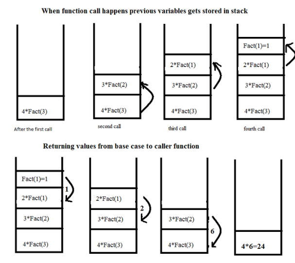

# 172_algorithm_theory
## 01_recursive_call.md


## 재귀 용법 (recursive call, 재귀 호출)

### 1. 재귀 용법 (recursive call, 재귀 호출)
* 함수 안에서 동일한 함수를 호출하는 형태
* 여러 알고리즘 작성시 사용되므로, 익숙해져야 함

```python
def factorial(num):
    if num > 1:
        return num * factorial(num - 1)
    else:
        return num
    
for num in range(10):
    print (factorial(num))
```


### 예제 - 시간 복잡도와 공간 복잡도
* factorial(n) 은 n - 1 번의 factorial() 함수를 호출해서, 곱셈을 함 
  - 일종의 n-1번 반복문을 호출한 것과 동일
  - factorial() 함수를 호출할 때마다, 지역변수 n 이 생성됨

* 시간 복잡도/공간 복잡도는 O(n-1) 이므로 결국, 둘 다 O(n)


### 재귀 호출의 일반적인 형태
```python
# 일반적인 형태1
def function(입력):
    if 입력 > 일정값: # 입력이 일정 값 이상이면
        return function(입력 - 1) # 입력보다 작은 값
    else:
        return 일정값, 입력값, 또는 특정값 # 재귀 호출 종료
        
# 일반적인 형태2
def function(입력):
    if 입력 <= 일정값:              # 입력이 일정 값보다 작으면
        return 일정값, 입력값, 또는 특정값              # 재귀 호출 종료
    function(입력보다 작은 값)
    return 결과값

def factorial(num):
    if num <= 1:
        return num
    
    return num * factorial(num - 1)
```


### 재귀 호출은 스택의 전형적인 예
* 내부적으로 스택처럼 관리된다.
* 

### 파이썬
> 파이썬에서 재귀 함수는 깊이가(한번에 호출되는...) 1000회 이하가 되어야 함 제한  
> 제한 해제도 가능하긴함