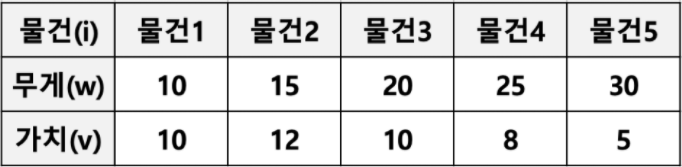

# 172_algorithm_theory
## 172_07_Greedy

## Greedy Algorithm

### 1. 탐욕 알고리즘 이란?
- Greedy algorithm 또는 탐욕 알고리즘 이라고 불리움
- 최적의 해에 가까운 값을 구하기 위해 사용됨
- 여러 경우 중 하나를 결정해야할 때마다, **매순간 최적이라고 생각되는 경우를 선택**하는 방식으로 진행해서, 최종적인 값을 구하는 방식

### 2. 탐욕 알고리즘 예
### 문제1: 동전 문제
  - 지불해야 하는 값이 4720원 일 때 1원 50원 100원, 500원 동전으로 동전의 수가 가장 적게 지불하시오.
    - 가장 큰 동전부터 최대한 지불해야 하는 값을 채우는 방식으로 구현 가능
    - 탐욕 알고리즘으로 매순간 최적이라고 생각되는 경우를 선택하면 됨

### 문제2: 부분 배낭 문제 (Fractional Knapsack Problem)
  - 무게 제한이 k인 배낭에 최대 가치를 가지도록 물건을 넣는 문제
    - 각 물건은 무게(w)와 가치(v)로 표현될 수 있음
    - 물건은 쪼갤 수 있으므로 물건의 일부분이 배낭에 넣어질 수 있음, 그래서 Fractional Knapsack Problem 으로 부름
      - Fractional Knapsack Problem 의 반대로 물건을 쪼개서 넣을 수 없는 배낭 문제도 존재함 (0/1 Knapsack Problem 으로 부름)
  
    
