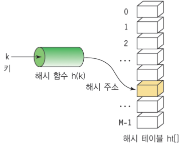

# [171]_data_structure
## [171_08]_Hash_Table.md

# 해쉬 테이블 (Hash Table)

* 키(Key)에 데이터(Value)를 저장하는 데이터 구조  
    * Key를 통해 바로 데이터를 받아올 수 있으므로, 속도가 획기적으로 빨라짐
    * 파이썬 딕셔너리(Dictionary) 타입, 자바 HashMap, JSON등이 해쉬 테이블의 예
    * 보통 배열로 미리 Hash Table 사이즈만큼 생성 후에 사용 (메모리공간과 탐색 시간을 맞바꾸는 기법 - 공간을 좀 더 많이 차지한다.)
  
## 알아둘 용어
    해쉬(Hash): 임의 값을 고정 길이로 변환하는 것
    해쉬 테이블(Hash Table): 키 값의 연산에 의해 직접 접근이 가능한 데이터 구조
    해싱 함수(Hashing Function): Key에 대해 산술 연산을 이용해 데이터 위치를 찾을 수 있는 함수
    해쉬 값(Hash Value) 또는 해쉬 주소(Hash Address): Key를 해싱 함수로 연산해서, 해쉬 값을 알아내고, 이를 기반으로 해쉬 테이블에서 해당 Key에 대한 데이터 위치를 일관성있게 찾을 수 있음
    슬롯(Slot): 한 개의 데이터를 저장할 수 있는 공간
    저장할 데이터에 대해 Key를 추출할 수 있는 별도 함수도 존재할 수 있음

## 장단점과 주요 용도
* 장점
  * 데이터 저장/읽기 속도가 빠르다. (검색 속도가 빠르다.)
  * 해쉬는 키에 대한 데이터가 있는지(중복) 확인이 쉬움
* 단점
  * 일반적으로 저장공간이 좀더 많이 필요하다. 
  * 여러 키에 해당하는 주소가 동일할 경우 충돌을 해결하기 위한 별도 자료구조가 필요함
* 주요 용도
  * 검색이 많이 필요한 경우
  * 저장, 삭제, 읽기가 빈번한 경우
  * 캐쉬 구현시 (중복 확인이 쉽기 때문)
  
---

## 충돌(Collision) 해결 알고리즘 
    해쉬 테이블의 가장 큰 문제는 충돌(Collision)의 경우입니다. 
    충돌(Collision) 또는 해쉬 충돌(Hash Collision)이라고 부릅니다.

### Chaining 기법
    Open Hashing 기법 중 하나
    해쉬 테이블 저장공간 외의 공간을 활용하는 기법
    충돌이 일어나면, 링크드 리스트라는 자료 구조를 사용해서, 
    링크드 리스트로 데이터를 추가로 뒤에 연결시켜서 저장하는 기법

### Linear Probing 기법
    Close Hashing 기법 중 하나
    해쉬 테이블 저장공간 안에서 충돌 문제를 해결하는 기법
    충돌이 일어나면, 해당 hash address의 다음 address부터 맨 처음 나오는 빈공간에 저장하는 기법
    저장공간 활용도를 높이기 위한 기법

### 빈번한 충돌을 개선하는 기법
    해쉬 함수 재정의 및 해쉬 테이블 저장공간을 확대

### 참고: 해쉬 함수와 키 생성 함수
    파이썬의 hash() 함수는 실행할 때마다, 값이 달라질 수 있음
    유명한 해쉬 함수들: SHA(Secure Hash Algorithm, 안전한 해시 알고리즘)
    어떤 데이터도 유일한 고정된 크기의 고정값을 리턴해주므로, 해쉬 함수로 유용하게 활용 가능

---
## 시간 복잡도
    일반적인 경우(Collision이 없는 경우)는 O(1)
    최악의 경우(Collision이 모두 발생하는 경우)는 O(n)
    해쉬 테이블의 경우, 일반적인 경우를 기대하고 만들기 때문에, 시간 복잡도는 O(1) 이라고 말할 수 있음

## 검색에서 해쉬 테이블의 사용 예
    16개의 배열에 데이터를 저장하고, 검색할 때 O(n)
    16개의 데이터 저장공간을 가진 위의 해쉬 테이블에 데이터를 저장하고, 검색할 때 O(1)