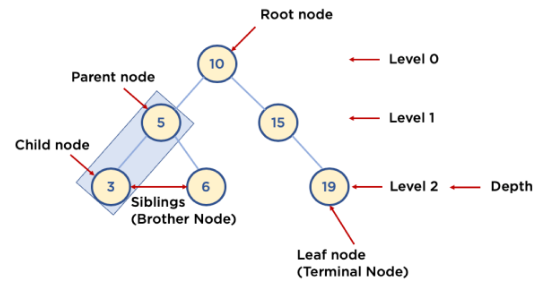
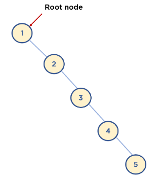

# [171]_data_structure
## [171_09]_Tree.md

## 트리 (Tree) 구조
* Node와 Branch를 이용해서, 사이클을 이루지 않도록 구성한 데이터 구조
* 실제로 어디에 많이 사용되나?
    * 트리 중 이진 트리 (Binary Tree) 형태의 구조로, 탐색(검색) 알고리즘 구현을 위해 많이 사용됨
    

## 알아둘 용어  
|단축키|기능|
|---|---|
|Node|트리에서 데이터를 저장하는 기본 요소 (데이터와 다른 연결된 노드에 대한 Branch 정보 포함)|  
|Root Node|트리 맨 위에 있는 노드  
|Level|최상위 노드를 Level 0으로 하였을 때, 하위 Branch로 연결된 노드의 깊이를 나타냄  
|Parent Node|어떤 노드의 다음 레벨에 연결된 노드
|Child Node| 어떤 노드의 상위 레벨에 연결된 노드  
|Leaf Node (Terminal Node)| Child Node가 하나도 없는 노드  
|Sibling (Brother Node)| 동일한 Parent Node를 가진 노드 
|Depth| 트리에서 Node가 가질 수 있는 최대 Level  

## 이진 트리와 이진 탐색 트리 (Binary Search Tree)
  * 이진 트리: 노드의 최대 Branch가 2인 트리
  * 이진 탐색 트리 (Binary Search Tree, BST): 이진 트리에 다음과 같은 추가적인 조건이 있는 트리
    * 왼쪽 노드는 해당 노드보다 작은 값, 오른쪽 노드는 해당 노드보다 큰 값을 가지고 있음  
[참고사이트](https://blog.penjee.com/5-gifs-to-understand-binary-search-tree/#binary-search-tree-insertion-node)
      
## 이진 탐색 트리의 장점과 주요 용도
    주요 용도: 데이터 검색(탐색)
    장점: 탐색 속도를 개선할 수 있음
    단점은 복잡하다.
[참고사이트](https://blog.penjee.com/5-gifs-to-understand-binary-search-tree/#binary-search-tree-insertion-node)

## 이진 탐색 트리의 시간 복잡도,  단점
### 시간 복잡도 (탐색시)
    depth (트리의 높이) 를 h라고 표기한다면, O(h)
    n개의 노드를 가진다면,  ℎ=𝑙𝑜𝑔2𝑛  에 가까우므로, 시간 복잡도는  𝑂(𝑙𝑜𝑔𝑛) 
    참고: 빅오 표기법에서  𝑙𝑜𝑔𝑛  에서의 log의 밑은 10이 아니라, 2입니다.
    한번 실행시마다, 50%의 실행할 수도 있는 명령을 제거한다는 의미. 즉 50%의 실행시간을 단축시킬 수 있다는 것을 의미함

### 단점
    평균 시간 복잡도는  𝑂(𝑙𝑜𝑔𝑛)  이지만,
    이는 트리가 균형잡혀 있을 때의 평균 시간복잡도이며,
    다음 예와 같이 구성되어 있을 경우, 최악의 경우는 링크드 리스트등과 동일한 성능을 보여줌 (  𝑂(𝑛)  )
