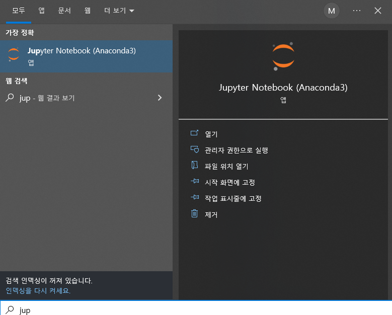
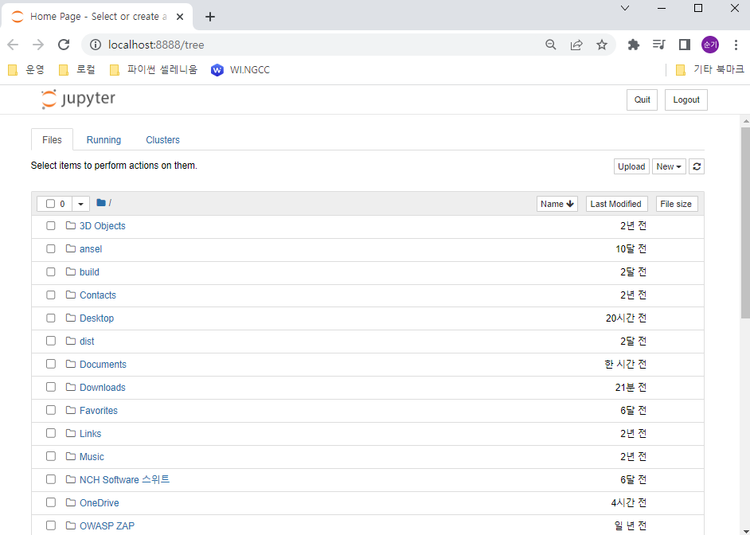
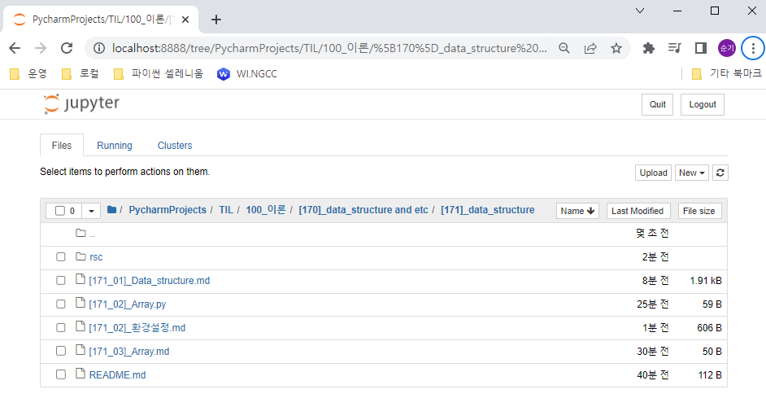

# [171]_data_structure
## [171_02]_환경설정.md
    자료구조와 알고리즘은 프로그래밍의 기본이다.
    Clean Code! 작성을 함께 해보자.

## 환경설정
    AnaConda 
    conda create -n ds python=3.6.8
    activate ds 
    pip install --upgrade pip
    pip install jupyter

### jupyter notebook 란?
    Editor(PyCharm) VS jupyter notebook
    한줄 한줄 코드 실행 결과 확인이 쉽다.
    문서와 코드를 함께 작성/저장할 수 있다.

### 단축키
    a(상단부에 셀 만들기)
    b(하단부에 셀 만들기)
    shift + enter 실행