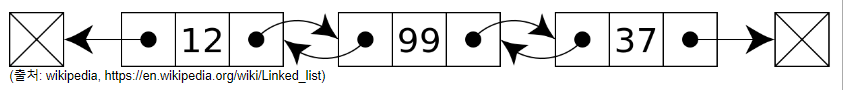

# [171]_data_structure
## [171_06]_Linked List.md

#  링크드 리스트 (Linked List)
    연결 리스트라고도 함
    배열은 순차적으로 연결된 공간에 데이터를 나열하는 데이터 구조
    링크드 리스트는 떨어진 곳에 존재하는 데이터를 화살표로 연결해서 관리하는 데이터 구조
    본래 C언어에서는 주요한 데이터 구조이지만, 파이썬은 리스트 타입이 링크드 리스트의 기능을 모두 지원

## 기본 구조와 용어
    노드(Node): 데이터 저장 단위 (데이터값, 포인터) 로 구성
    포인터(pointer): 각 노드 안에서, 다음이나 이전의 노드와의 연결 정보를 가지고 있는 공간

* 일반적인 링크드 리스트 형태
  

노드 총 3개 구조   
(출처: wikipedia, https://en.wikipedia.org/wiki/Linked_list)

