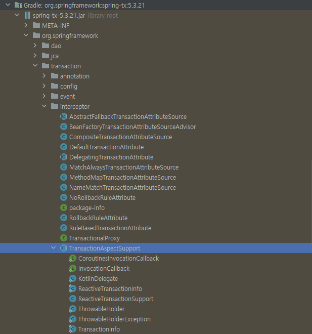
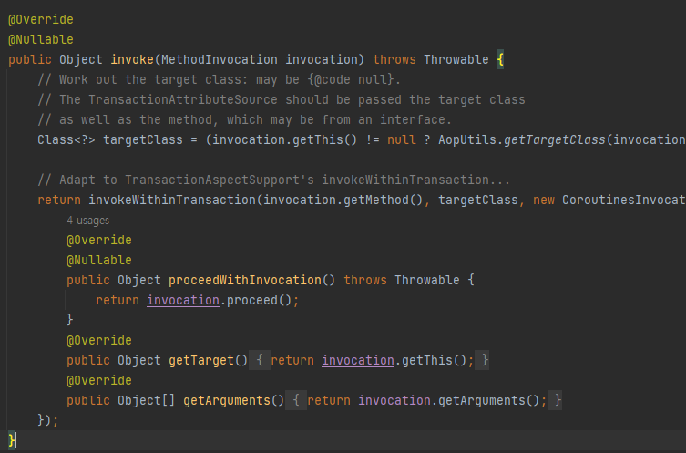
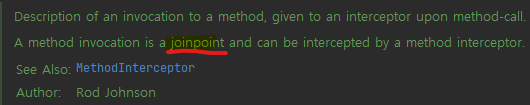
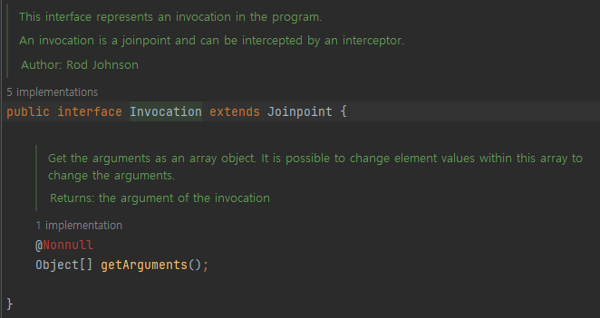
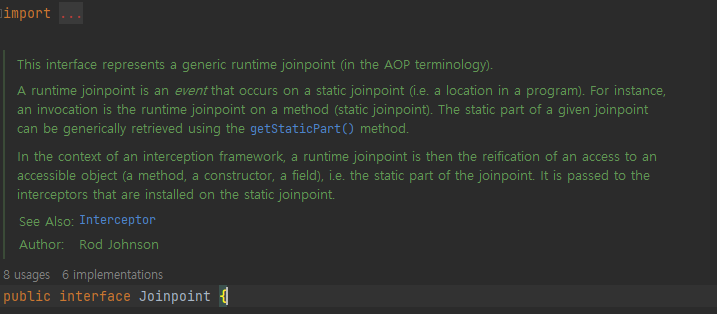
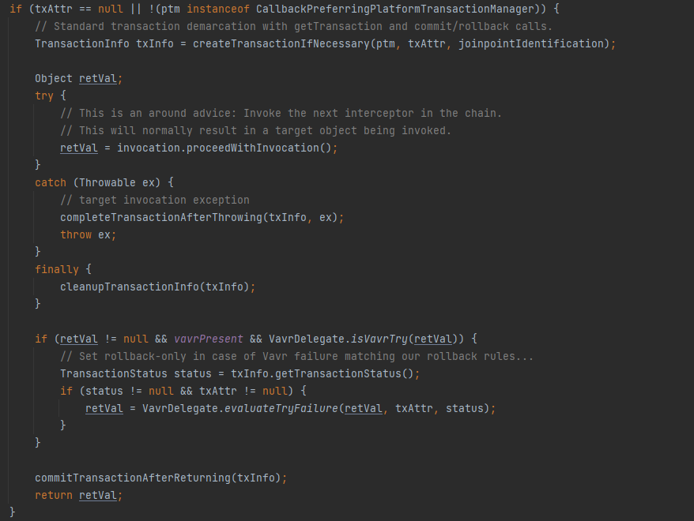

# [191]_웹기초
## [191_02]_Transaction.md
***[WIKI](https://ko.wikipedia.org/wiki/ACID)***

# ACID (Atomic Consistency Isolation Durability)

## Atomic (원자성)
    트랜잭션과 관련된 작업들이 부분적으로 실행되다가 중단되지 않는 것을 보장하는 능력이다. 
    예를 들어, 자금 이체는 성공할 수도 실패할 수도 있지만 보내는 쪽에서 돈을 빼 오는 작업만 성공하고 
    받는 쪽에 돈을 넣는 작업을 실패해서는 안된다. 원자성은 이와 같이 중간 단계까지 실행되고 실패하는 일이 없도록 하는 것이다.
    하나가 실패하면 모두 실패해야 하고 하나가 성공하면 모두 성공해야 한다.
    
## Consistency (일관성)
    트랜잭션이 실행을 성공적으로 완료하면 언제나 일관성 있는 데이터베이스 상태로 유지하는 것을 의미한다. 
    무결성 제약이 모든 계좌는 잔고가 있어야 한다면 이를 위반하는 트랜잭션은 중단된다.

## Isolation (독립성 / 고립성)
    성능관련 이유로 인해 이 특성은 가장 유연성 있는 제약 조건이다. 

    트랜잭션을 수행 시 다른 트랜잭션의 연산 작업이 끼어들지 못하도록 보장하는 것을 의미한다. 
    이것은 트랜잭션 밖에 있는 어떤 연산도 중간 단계의 데이터를 볼 수 없음을 의미한다. 
    은행 관리자는 이체 작업을 하는 도중에 쿼리를 실행하더라도 특정 계좌간 이체하는 양 쪽을 볼 수 없다. 
    공식적으로 고립성은 트랜잭션 실행내역은 연속적이어야 함을 의미한다. 
    
## Durability (지속성)
    성공적으로 수행된 트랜잭션은 영원히 반영되어야 함을 의미한다. 
    시스템 문제, DB 일관성 체크 등을 하더라도 유지되어야 함을 의미한다. 
    전형적으로 모든 트랜잭션은 로그로 남고 시스템 장애 발생 전 상태로 되돌릴 수 있다. 
    트랜잭션은 로그에 모든 것이 저장된 후에만 commit 상태로 간주될 수 있다.
---

# 스프링은 어떻게 트랜잭션을 관리하는가?



## raw-level

```java
    private final EntityManager em;
    public void createUser(){
        EntityTransaction transaction = em.getTransaction();
        try{
            transaction.begin();

            // business logic start
            UserInfo userInfo = UserInfo.builder()
                    .userId("milk1234")
                    .userPw("1234")
                    .name("MS")
                    .age(29)
                    .jobType(JobType.Developer)
                    .foodCountry(FoodCountry.Korea)
                    .build();
            userRepository.save(userInfo);
            userRepository.delete(userInfo1);

            // business logic end
            transaction.commit();

        }catch (Exception e){
            transaction.rollback();
            throw e;
        }
    }
```

## @Transactional

```java
    @Transactional
    public void createUser(){
            // business logic start
            UserInfo userInfo = UserInfo.builder()
                    .userId("milk1234")
                    .userPw("1234")
                    .name("MS")
                    .age(29)
                    .jobType(JobType.Developer)
                    .foodCountry(FoodCountry.Korea)
                    .build();
            userRepository.save(userInfo);
            userRepository.delete(userInfo1);
    }
```
### TransactionInterceptor Invoke
    상세 설정? 등을 볼 수 있는데
    MethodInvocation 은 joinpoint이다. 그리고 메소드를 인터셉트 해서 앞쪽에서 뭔가 작업해주고 리턴해주는? 아이







### Invocation


### Joinpoint

  

    This interface represents a generic runtime joinpoint (in the AOP terminology).
    A runtime joinpoint is an event that occurs on a static joinpoint (i.e. a location in a program). 
    For instance, an invocation is the runtime joinpoint on a method (static joinpoint). 
    The static part of a given joinpoint can be generically retrieved using the getStaticPart() method.
    In the context of an interception framework, a runtime joinpoint is then the reification of an access to an accessible object (a method, a constructor, a field),
    i.e. the static part of the joinpoint. It is passed to the interceptors that are installed on the static joinpoint.
    인터페이스는 일반 런타임 조인포인트(AOP 용어)를 나타냅니다.
    런타임 조인포인트는 정적 조인포인트(즉, 프로그램의 위치)에서 발생하는 이벤트입니다.
    예를 들어 호출은 메서드의 런타임 조인포인트(정적 조인포인트)입니다. 
    주어진 조인포인트의 정적 부분은 일반적으로 getStaticPart() 메서드를 사용하여 검색할 수 있습니다.
    프레임워크의 맥락에서 인터셉트하는 런타임 조인포인트는 액세스 가능한 객체(메소드, 생성자, 필드), 
    즉 조인포인트의 정적 부분에 대한 액세스의 구체화입니다. 정적 조인포인트에 설치된 인터셉터에 전달됩니다.


## TransactionAspectSupport
