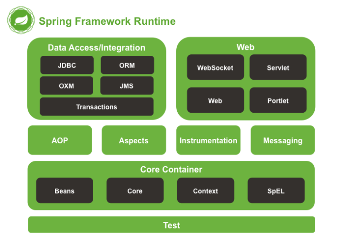
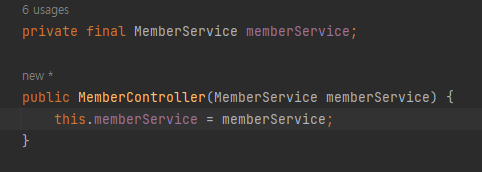

# SpringCore

* [410_00_Spring_MVC_pattern.md](%5B410_00%5D_Spring_MVC_pattern.md)
* [410_01_자바, 스프링, 스프링 부트.md](%5B410_01%5D_자바,%20스프링,%20스프링%20부트.md)
* [410_02_스프링의 Core Technology.md](%5B410_02%5D_스프링의%20Core%20Technology.md)
* [410_03_IOC DI.md](%5B410_03%5D_IOC,%20DI.md)
* [410_04_AOP.md](%5B410_04%5D_AOP.md)
* [410_05_Validation.md](%5B410_05%5D_Validation.md)
* [410_06_Resource.md](%5B410_06%5D_Resource.md)
* [410_07_SpEL.md](%5B410_07%5D_SpEL.md)
* [410_08_Null Safety.md](%5B410_08%5D_Null%20Safety.md)

### Reference 
[docs.spring.io](https://docs.spring.io/spring-framework/docs/5.0.0.RC2/spring-framework-reference/overview.html#overview-modules)

[뒤로](README.md) / [위로](#SpringCore)

## Core (DI, IoC)
    스프링의 근간 내가 만들 클래스를 스프링이 직접 관리하여 어플리케이션을 동작하게 한다. 
    DI(Dependency Injection) : 의존성 주입
    IOC(Inversion of Control) : 제어의 역전
    주로 컨트롤러에서 서비스를 의존성 주입하여..
    제어의 역전을 일으킨다.

    
    스프링에선 어플리케이션 컨택스트가 그 역활을 담당하며 
    직접(New) 만드는게 아니라 스프링이 담당해서 해준다
    IOC  
        memberSerivce에 대한 생성자를 어플리케이션 컨택스트 만들어줌
    DI 
        Member컨트롤러는 memberSerivce에 의존하고 있다.
        memberSerivce를 의존성 주입한다.

## 관점 지향 프로그래밍 - AOP(Aspect Oriented Programming)
    공통적인 코드를 프레임워크 레벨에서 지원해준다. 
    @Transactional 어노테이션등 
    특정 메서드가 들어가기전에 트랜잭션을 일으키고 
    Exception이 발생하면 정책에 따라 롤백하거나 커밋하는등.
    로그를 일괄 기록하는등 조인 포인트에 조인해서
    특정 aspect를 되돌려 주는 형태로 동작한다. 

## Validation, Data binding 
    검증 그리고 외부에서 받은 데이터를 담아내는 방법

## Resource
    스프링 내부에서 설정이 들어있는 파일들에 접근하는 동작 원리

## SpEL
    짧은 표현식을 통해 필요한 데이터나 설정 값을 얻어올 수 있게 하는 특별한 형태의 표현식에 가까운 간편한 언어

## Null-Safety
    Null을 조금 더 잘 다루고 싶다면?
    @NonNull Annotation 

# 스프링의 디자인 철학

- 모든 기능에서 다양한 가능성(다양한 모듈)을 사용 가능, 심지어 외부 모듈을 활용 가능
    - 너무 높은 자유도 어떤 점에서는 스프링을 어렵게 하는 요소
- 유연하게 계속 추가 개발을 하고 있는 프레임워크
- 이전 버전과의 강력한 호환성
    - 너무 많은 레거시 때문에 코드의 복잡성이 높아지긴 함
- API 디자인을 섬세하게 노력한다
    - 스프링 코드 자체가 하나의 좋은 참고 소스
- 높은 코드 품질을 유지하려 함
    - 스프링 프로젝트 github은 아주 좋은 참고 소스이자 PR과 이슈 관리도 좋은 프로세스 참고용

→ 한마디로 높은 자유도를 주고 계속 발전하는 고품질의 다양성이 있는 프로젝트, 그런데 너무 자유로워서 때론 어렵다.