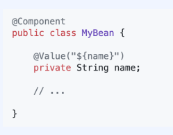

# Spring Boot
* [01. Spring Boot Properties](#spring-boot-properties)
* [02. Spring Boot 1 vs 2](#spring-boot-properties)
* [03. **Spring** Boot 2.1](#spring-boot-21)
* [04. Spring Boot 2.2](#spring-boot-22)
* [05. Spring Boot 2.3](#spring-boot-23)

##
### Reference  

[뒤로](README.md) / [위로](#spring-boot)

## Spring Boot Properties
    • 스프링 부트의 기본 기능 전체를 튜닝하는 부트 전용 설정 프로퍼티
    • classpath:application.properties, application.yml 로 제어 가능
    • https://docs.spring.io/spring-boot/docs/current/reference/html/applicationproperties.htm

    • 부트의 기능 거의 대부분을 제어 가능
    • 기본값이 세팅되어 있어서 심지어 아무 것도 쓰지 않아도 작동함
    • 부트를 쓰는데 설정이 자꾸만 별도의 자바 코드로 등장한다?

## @Component vs. @Configuration
    "애노테이션이 의도에 맞게 사용되었는지 잘 봐주자"
    • 빈 설정은 @Configuration, 클래스 빈 등록은 @Component
    • 정확한 목적을 모르고 쓰면 "잘 모르겠는데 어쨌든 돌아가요" 운영의 시한폭탄
    • IDE 가 노란 줄 그어주면
    • 응 돌아는 간다는 거지 (X)
    • 내 사전에 노란 줄이란 있을 수 없다 (O)
### @Component vs @Bean
    @Component
    • Class-level annotation
    • 등록하려는 빈의 클래스 소스가 편집 가능한 경우 사용
    • auto-detection 에 걸림
    @Bean
    • method-level annotation
    • 좀 더 읽기 쉬움
    • 인스턴스화 하는 코드가 수동으로 작성됨
    • 빈의 인스턴스 코드와 클래스 정의가 분리된 구조
    • 따라서 외부 라이브러리, 써드 파티 클래스도 빈으로 등록 가능

### @Component
    "컴포넌트는 빈이다."
    "이 클래스는 커스텀 빈이다."
    1. @ComponentScan -> base package 에서부터 모든 @Component 검색
    2. 인스턴스화: 필요한 의존성을 모두 주입
    3. 스프링 컨테이너에 등록: 필요한 곳에 주입

    컴포넌트에 해당하는 스테레오 타입 애노테이션들
    • @Controller
    • @Service
    • @Repository

### @Configuration
    "이 클래스는 각종 빈 설정을 담고 있다."
    1. @SpringBootApplication 이 컴포넌트 스캔을 통해 @Configuration 을 찾아냄
    2. 안의 빈 설정(메소드)을 읽어서 스프링 컨테이너에 등록
    3. 필요한 곳에 주입
    4. 또는 각종 스프링 인터페이스의 구현에 함께 활용

[뒤로](README.md) / [위로](#spring-boot)

## Externalized Configuration
    각종 설정값을 외부로 분리해낸 것
    • 서로 다른 환경에서도 사용할 수 있음
    • 애플리케이션을 새로 컴파일하지 않고 설정값을 바꿀 수 있음
    • 종류
    • Java properties file
    • YAML
    • environment variable
    • command-line argument

### 우선순위 
    외부 설정을 읽어들이는 순서: 아래 설정이 위에서 읽은 것을 덮어씀
    1.디폴트 프로퍼티
    2.@Configuration 클래스에 @PropertySource 로 정의된 것
    3.설정 파일: application.properties
    4.RandomValuePropertySource
    5.OS 환경변수
    6.자바 시스템 프로퍼티: System.getProperties()
    7.JNDI 속성: java:comp/env
    8.ServletContext - 초기 파라미터
    9.ServletConfig - 초기 파라미터
    10.SPRING_APPLICATION_JSON 안의 프로퍼티들
    11.Command-line arguments
    12.테스트에 사용된 프로퍼티들
    13.@TestPropertySource
    14.Devtools 글로벌 세팅: $HOME/.config/spring-boo

### 설정 파일(config data)의 우선 순위
    1.JAR 패키지 안의 application.properties, application.yaml
    2.JAR 패키지 안의, 프로파일이 지정된 파일: application-{profile}.properties
    3.JAR 패키지 밖의 파일
    4.JAR 패키지 밖의, 프로파일이 지정된 파일
#### 설정 파일(Config data) 의 위치
    1.classpath
     1.1.classpath:/
     1.2.classpath:/config
    2.현재 디렉토리
     2.1../
     2.2../config
     2.3../config/child
#### 설정 파일(Config data) 을 읽는 방법
    • @value
    • Environment
    • @ConfigurationProperties

### 1. @value
    • SpEL 로 프로퍼티명을 표현
    •type-safe 하지 않음
    •인스턴스화 이후에 주입하므로, final 쓸 수 없음
    •생성자 안에서 보이지 않음 (대안: @PostConstruct)
    • Relaxed binding 지원 (kebab-case only)
    • meta-data 없음 (javadoc은 적용 가능)

[뒤로](README.md) / [위로](#spring-boot)