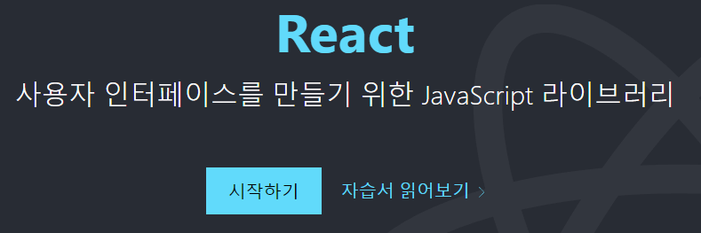

# 2022-07-04

# TIL 320. React

## 언어 순위  

## Web Frameworks  

## Other tools  

## 라이브러리 vs 프레임워크

* 라이브러리는 개발 편의를 위한 도구의 모음
* 프레임워크는 기반 구조까지 잡혀있음.

* 라이브러리는 공구
* 프레임워크는 공장

## https://ko.reactjs.org/

