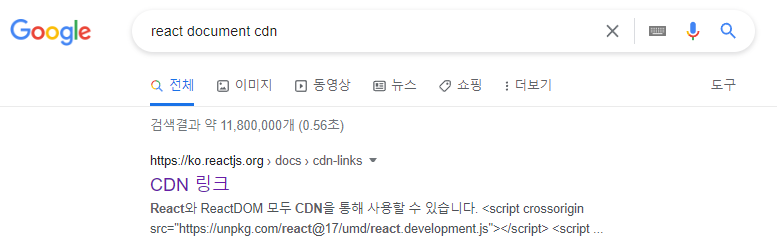

# 2022-07-04

# [TIL 321_01] React 기초

## [DOM 이란?](https://developer.mozilla.org/ko/docs/Web/API/Document_Object_Model)
***    

## Vanilla JS
    순수 자바스크립트를 의미한다.
    특정 라이브러리, 프레임워크를 사용하지 않은 JavaScript를 말함.

## [CodeSandBox](https://codesandbox.io/)
    프론트엔드 코드를 작성하고 시도해볼 수 있는 센드박스

    const rootEl = document.getElementById("root");

## CDN (Content Delivery Network)
    웹에서 사용되는 다양한 컨텐츠를 저장하여 제공하는 시스템    

## 의외로 중요한 검색하는 방법  

## JSX

    문자도 HTML도 아닌 JavaScript의 확장 문법
    JSX -> React.creteElement 표현식
    Babel -> JavaScript Complier
    JSX 다루기 -> spread 연산자 (변수에 HTML 태그를 다룰 수 있으며 그외 모든 값들을 자바스크립트로 다룰 수 있게 해준다.)

### [Babel](https://babeljs.io)
    JavaScript Complier

    Complier : 언어 해석기, 특정 언어를 다른 프로그래밍 언어로 옮기는 프로그램
    https://babelis.io

## Element 
    function -> 재사용 가능한 Element
    Custom Element -> Upper case
    children 제한 -> 없음

[`this is code`](%5B321_01%5D_react.html)

## [작업파일](https://codesandbox.io/s/main-fork-gkdhzk?file=/index.html)

## Interpolation 
[CodeSandbox](https://codesandbox.io/s/js-and-jsx-tdxpeg?file=/index.html)  

    JS, JSX를 섞어쓰는것
    이미 HTML에서 쓰고 있었다. 
    리엑트에선 element를 그릴때 전부 다 쓸수 있는것이 장점
