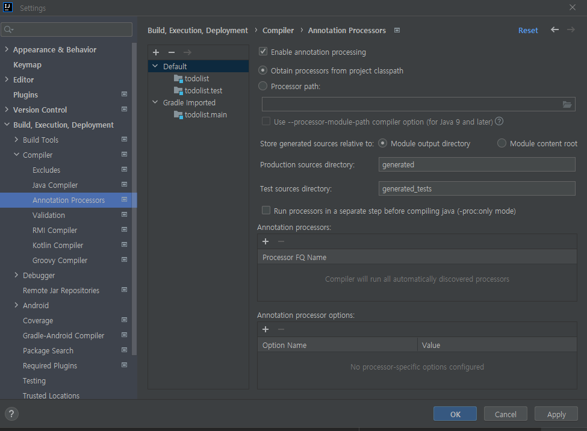
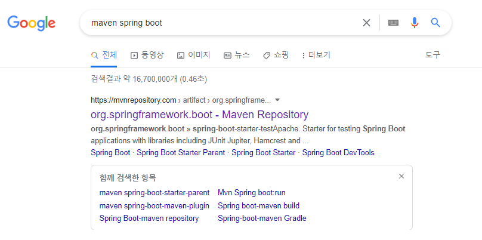

# Todo List 애플레케이션 서버
* []()

## IDE
    IntelliJ

## Back 
    Spring Boot
    Java
    Maven vs Gradle : Gradle 사용


## 요구사항 및 기능 명세
* 아이템 추가
* 선택 아이템 수정, 삭제
* 전체 목록 조회
* 전체 목록 삭제
* 특정 아이템 조회
    
## API 스팩
|method|endpoint|기능|request|response
|---|---|---|---|---|
|POST|/|todo 아이템 기능 추가|{"title": "블로그 만들기 "}|{ ""id"": 17,
    ""title"": ""자료구조 공부하기"",
    ""order"": 0,
    ""completed"": false,
    ""url"": ""http://localhost:8080/17""
}|


## IntelliJ란
    JetBrains사에서 제작한 상용 자바 통합 개발 환경(IDE)
    Community Edition - 무료 버전, 웹 관련 기능을 사용할 수 없다.
    Ultimate Edition - 상용 버전, 모든 기능 제공
    
    자바개발 IDE중 엄청 좋다고 소문이 자자해서 한번 써보기로 결정
    좋은지 한번 경험해보자 

## IntelliJ 장점
    단축키, 디버깅, 테스트, 자동완성 등등 ..
    git 기능 연동이 편하다.
    UI가 예쁘다
    
## [IntelliJ 설치](https://www.jetbrains.com/ko-kr/idea/download/#section=windows)


## 기본 설정




```gradle
plugins {
    id 'org.springframework.boot' version '2.4.2'
    id 'io.spring.dependency-management' version '1.0.11.RELEASE'

    id 'java'
}

group 'org.example'
version '1.0-SNAPSHOT'

repositories {
    mavenCentral()
}

dependencies {
    implementation 'org.springframework.boot:spring-boot-starter-data-rest'
    implementation 'org.springframework.boot:spring-boot-starter-data-jpa'

    runtimeOnly 'com.h2database:h2'

    annotationProcessor("org.projectlombok:lombok")
    compileOnly("org.projectlombok:lombok")

    testImplementation('org.springframework.boot:spring-boot-starter-test') {
        exclude group: 'org.junit.vintage', module: 'junit-vintage-engine'
    }
}

test {
    useJUnitPlatform()
}
```

## PostMan
https://www.postman.com/downloads/