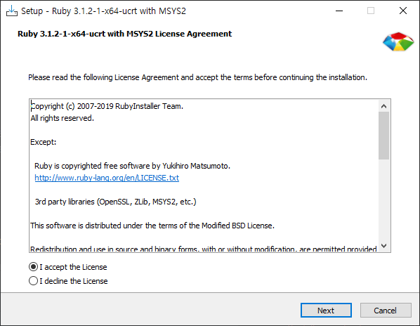
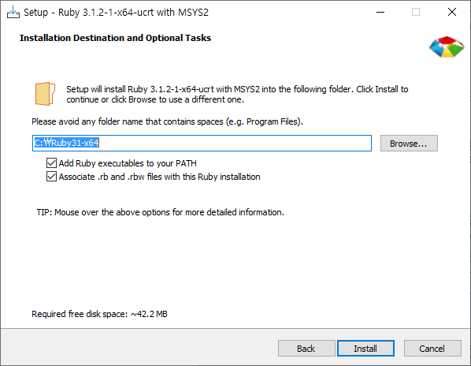
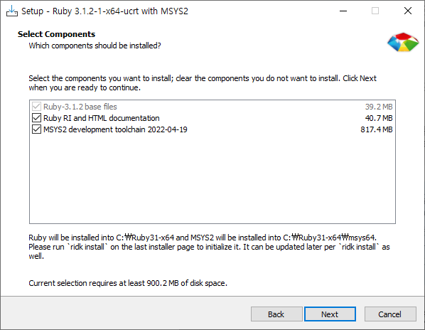
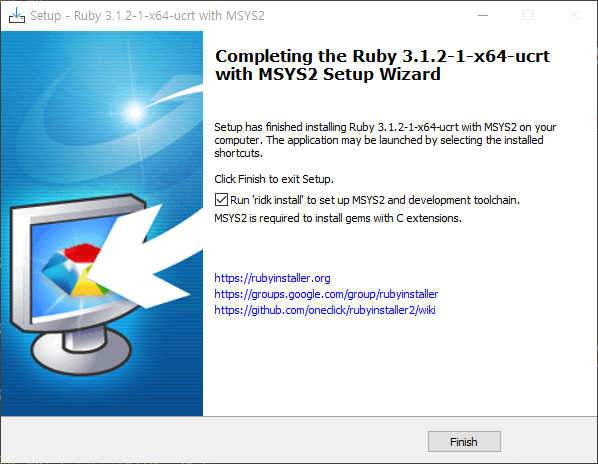
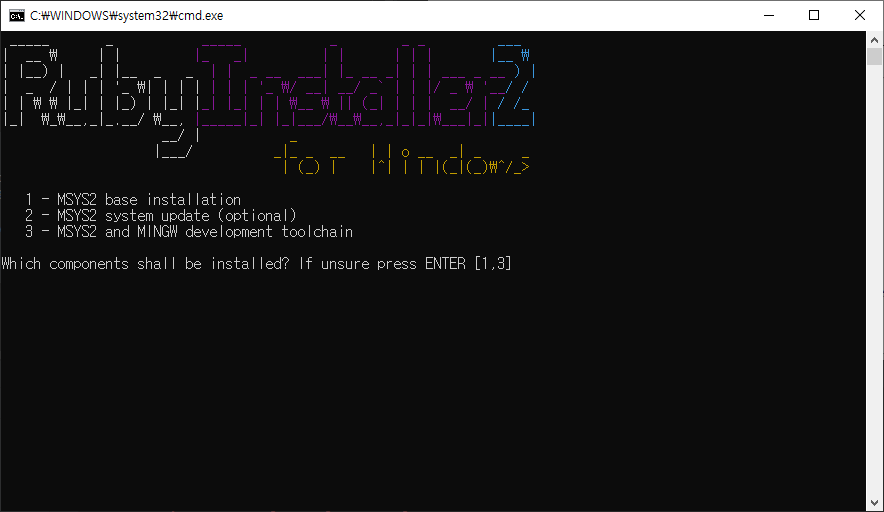

# 루비란 무엇인가?
    Ruby는 균형잡힌 언어입니다. 
    Ruby를 만든 유키히로 마츠모토는 그가 좋아하는 언어인 Perl, Smalltalk, Eiffel, Ada, Lisp를 섞어서 
    명령형 프로그래밍 언어이자 함수형 언어인 새로운 언어를 만들었습니다.
    
## 인터프리터 언어
    인터프리터 형식으로 실행되는 동적 객체 지향 스크립트 언어로서  
    인간에게 친숙한 언어를 지향하여 간결함과 생산성을 강조한 언어입니다.  

## 특징
    1. 루비는 오픈소스 객체 지향 프로그래밍 언어로, 가독성이 뛰어나다. 
    2. 코드 작성도 쉽고 직관적이면서 초급자가 쉽게 학습할 수 있는 언어 중 하나이다. 
    3. 수월한 언어 확장에 도움되는 ‘메타 프로그래밍’을 지원하며, 생산성이 높다
    4. 파이썬(Python)과 굉장히 유사한 면이 많으면서도 대비되는 특징들이 많아 두 언어는 자주 같이 언급되며 함께 무서운 속도로 성장하고 있습니다.

### 무엇을 할 수 있는가?
    다른 프로그래밍으로 가능한 대부분의 것이 가능하다.

### 쓸 때 느낌이 어떤가?
    개발자가 기쁨(JOY)를 느낄 수 있는 언어
    인간적인 언어

## 루비 환경 세팅
    레일즈 생태계는 C 기반의 루비젬과 명령행 기반의 환경에서 작업한다고 가정한다고 합니다.
    루비 인스톨러 방법으로 윈도우에서 사용이 가능합니다.

### 루비 다운로드
    https://rubyinstaller.org/downloads/

### 루비 설치

1, 2, 3 쭉 설치~

### Reference
[인프런 무료강의](https://www.inflearn.com/course/ruby-coin#curriculum)

[뒤로](../../README.md)