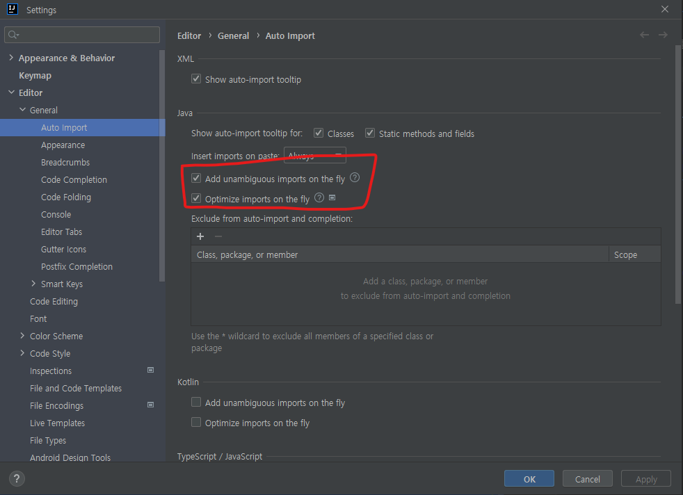

# RM
* [01. 자동으로 클래스 Import 세팅](#자동-import-세팅)
* [02. ](#2)
* [03. ](#3)

##
### Reference  1

[뒤로](README.md) / [위로](#컨탠츠-제목)

## 자동 Import 세팅

[뒤로](README.md) / [위로](#컨탠츠-제목)

## 2
[뒤로](README.md) / [위로](#컨탠츠-제목)

## 3
[뒤로](README.md) / [위로](#컨탠츠-제목)