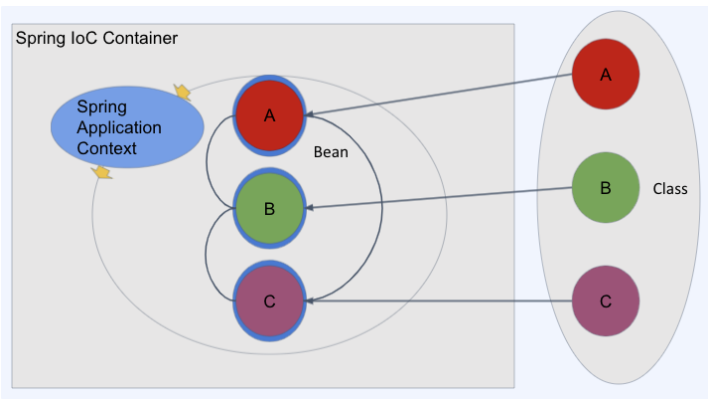

# [410]. Spring
## [410_03]_IOC(Inversion of Control) DI(Dependency Injection)


# 스프링 프레임워크 핵심기술 Core (DI - Dependency Injection, IoC)
    Spring IoC컨테이너가 우리가 필요한 인터페이스 자리에 객체를 생성해서 넣어준다(DI).
    IoC 컨테이너로 ApplicationContext 인터페이스를 구현한 오브젝트(객체)이다.
    ApplicationContext는 BeanFactory를 상속한 하위 인터페이스이다.
    IoC컨테이너를 통해 Bean이 관리된다. Bean이란 IoC컨테이너가 관리하는 대상(객체)이다.

## IOC(Inversion of Control) 
    IoC(Inversion of Control)란 "제어의 역전" => 제어의 흐름을 바꾼다라는 의미로, 
    말 그대로 메소드나 객체의 호출작업을 개발자가 결정하는 것이 아니라, 외부에서 결정되는 것을 의미한다.

    스프링 프레임워크도 객체를 생성하고 관리하고 책임지고 의존성을 관리해주는 컨테이너가 있는데,
    그것이 바로 IoC 컨테이너(=스프링 컨테이너) 입니다.

## IoC를 사용하는 이유 
* 스프링 애플리케이션에서는 오브젝트(빈)의 생성과 의존 관계 설정, 사용, 제거 등의 작업을 애플리케이션 코드 대신 스프링 컨테이너가 담당한다.
* 객체 간의 결합도를 줄이고 유연한 코드를 작성할 수 있게 하여 가독성, 코드 중복, 유지 보수를 편하게 할 수 있게 한다.

## DI(Dependency Injection)
    DI(Dependency Injection)란 스프링이 다른 프레임워크와 차별화되어 제공하는 의존 관계 주입 기능으로,
    의존하는 클래스에 대한 인스턴스를 직접 생성하지 않고, 
    컨테이너로부터 생성된 빈을 setter나 생성자를 통해 외부로부터 주입받는 것을 의미한다.

### DI를 사용하는 이유
* DI를 사용하면 결합도가 낮아지고 유연성이 높아진다. 그로 인해 코드 수정이 쉬워지며, 테스트 코드 작성도 쉬워진다.
* IoC를 실현하는데 DI가 필수이며 IoC를 사용하면, 귀찮은 객체 생명 주기 같은 프로그램 제어권을 프레임워크가 관리하도록 넘길 수 있다.
* 스프링 프레임워크 버전 4.3 이후에는 @Autowired도 생략되면서 생성자에 사용한 Bean만 선언하면 된다.   


## Bean 이란?

    자바에서의 javaBean
    데이터를 저장하기 위한 구조체로 자바 빈 규약이라는 것을 따르는 구조체
    private 프로퍼티와 getter/setter로만 데이터를 접근한다. 

```java
    public class JavaBean {
    private String id;
    private Integer count;
    
        public JavaBean(){}
    
        public String getId() {
            return id;
        }
    
        public void setId(String id) {
            this.id = id;
        }
    
        public Integer getCount() {
            return count;
        }
    
        public void setCount(Integer count) {
            this.count = count;
        }
    }
```

## 스프링에서 Bean
    스프링 IoC 컨테이너에 의해 생성되고 관리되는 객체
    자바에서처럼 new Object(); 로 생성하지 않는다.
    각각의 Beanㄷ글 끼리는 서로를 편리하게 의존할 수 있음



## 스프링 컨테이너란 (IoC)
    ApplicationContext 인터페이스를 통해 제공되는 스프링 컨테이너는 
    Bean 객체의 생성 및 조립(상호 의존성 관리)을 담당함 

### Bean의 등록
    과거에는 xml로 설정을 따로 관리하여 등록
    현재는 annotation 기반으로 Bean 등록 (컴포넌트 스캔을 통해서 등록된다.) 
    EX) @Bean, @Controller, @Service 

### Bean 등록 시 정보
- Class 경로
- Bean의 이름
    - 기본적으로는 원 Class 이름에서 첫 문자만 소문자로 변경 (카멜 케이스방식)→ accountService, userDao
    - 원하는 경우 변경 가능
- Scope : Bean을 생성하는 규칙
    - singleton : 컨테이너에 단일로 생성 ( 대부분 - 스프링 기동시 처음에 만드는 경우가 많다. 기본설정  )
    - prototype: 작업 시마다 Bean을 새로 생성하고 싶을 경우 (스프링 배치 or )
    - request: http 요청마다 새롭게 Bean을 생성하고 싶은 경우

### Bean LifeCycle callback(빈 생명주기 콜백함수)

- callback : 어떤 이벤트가 발생하는 경우 호출되는 메서드
- lifecycle callback
    - Bean을 생성하고 초기화하고 파괴하는 등 특정 시점에 호출되도록 정의된 함수
- 주로 많이 사용되는 콜백
    - @PostConstruct : 빈 생성 시점에 필요한 작업을 수행 (커낵션, 자원의 소모가 큰 경우)
    - @PreDestroy : 빈 파괴(주로 어플리케이션 종료) 시점에 필요한 작업을 수행 

###
    IOC나 DI는 레고와 같은 것이다
    스프링이 바닥판처럼 깔려있고, 우리는 그 위에서 멋진 조립을 만들면 된다.

[Spring](https://docs.spring.io/spring-framework/docs/current/reference/html/core.html#beans)
[JavaBeans](https://en.wikipedia.org/wiki/JavaBeans)

[용어정리]   
[컨테이너] - 객체의 생명주기를 관리, 생성된 인스턴스들에게 추가적인 기능을 제공하도록 하는 것  
