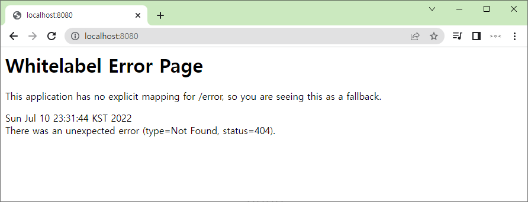

# [411]. Spring Project
## [411_01]_프로젝트 편리하게 세팅하는 방법

# spring starter

## 기초 세팅

## 실행

## 완료

## 생길 수 있는 에러 

    자바 버전을 17이상으로 다운로드 할경우 
    invalid source release 17 라는 에러가 뜬다.
    그럴 경우 자바 버전을 맞춰 줘야한다.
    

## build.gradle 에서 쉽게 바뀐다.
