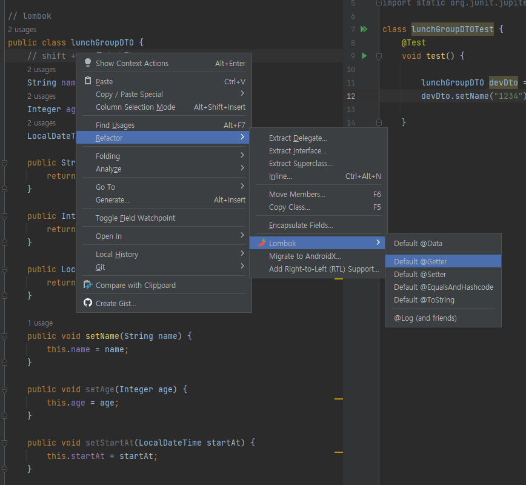
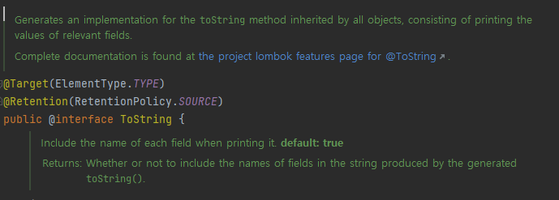
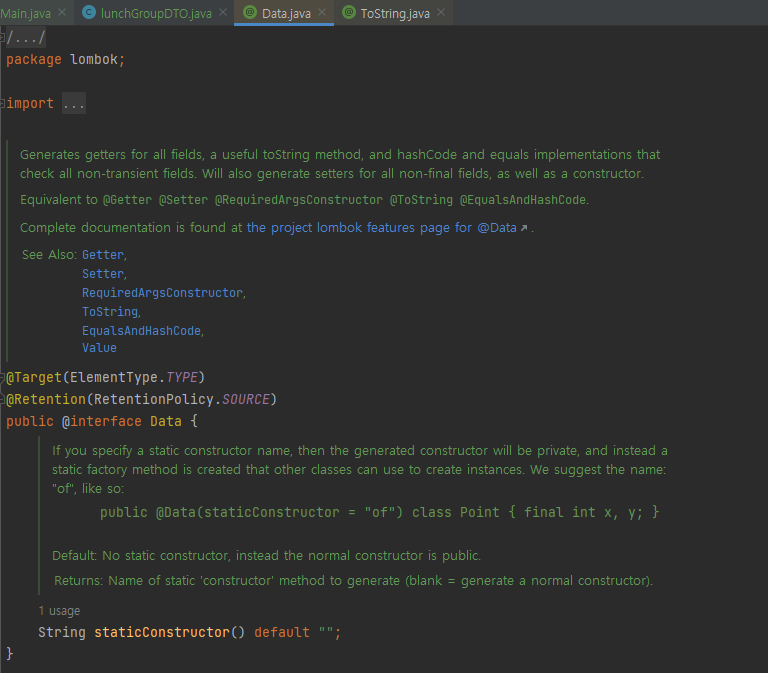

# [411]. Spring Project
## [411_02]_lombok

    보일러 플레이트 코드를 간편하게 자동으로 생성해주는 
    정말 편리한 라이브러리

## lombok 코드 보는법

## Getter, Setter
    DTO에서 Getter, Setter 세팅하는 부분을 대신해준다.

## ToString
    모든 객체에 대해서 ToString 으로 구현한다.

## Data
    Getter, Setter, RequiredArgsConstructor, ToString, EqualsAndHashCode, Value
    한번에 선언한다.
    조금 위험한 내용이 포함될 수 있기 때문에 나눠서 쓰자
