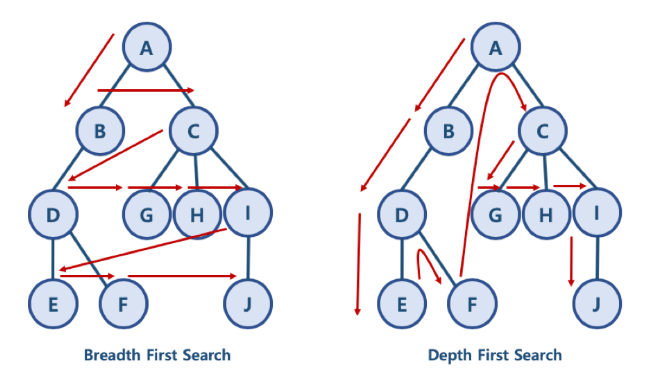

# 172_06_Graph
## 02_Breadth-First_Search.md

### 1. BFS 와 DFS 란?
* 대표적인 그래프 탐색 알고리즘
  - 너비 우선 탐색 (Breadth First Search): 정점들과 같은 레벨에 있는 노드들 (형제 노드들)을 먼저 탐색하는 방식
  - 깊이 우선 탐색 (Depth First Search): 정점의 자식들을 먼저 탐색하는 방식

#### BFS/DFS 방식 이해를 위한 예제
- BFS 방식: A - B - C - D - G - H - I - E - F - J 
  - 한 단계씩 내려가면서, 해당 노드와 같은 레벨에 있는 노드들 (형제 노드들)을 먼저 순회함
- DFS 방식: A - B - D - E - F - C - G - H - I - J 
  - 한 노드의 자식을 타고 끝까지 순회한 후, 다시 돌아와서 다른 형제들의 자식을 타고 내려가며 순화함




### 2. 파이썬으로 그래프를 표현하는 방법
- 파이썬에서 제공하는 딕셔너리와 리스트 자료 구조를 활용해서 그래프를 표현할 수 있음


```python
graph = dict()

graph['A'] = ['B', 'C']
graph['B'] = ['A', 'D']
graph['C'] = ['A', 'G', 'H', 'I']
graph['D'] = ['B', 'E', 'F']
graph['E'] = ['D']
graph['F'] = ['D']
graph['G'] = ['C']
graph['H'] = ['C']
graph['I'] = ['C', 'J']
graph['J'] = ['I']

```


### 시간 복잡도
- 일반적인 BFS 시간 복잡도
  - 노드 수: V
  - 간선 수: E
    - 위 코드에서 while need_visit 은 V + E 번 만큼 수행함
  - 시간 복잡도: O(V + E)
  