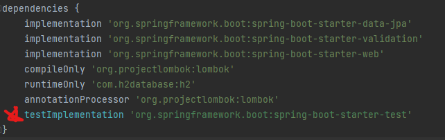
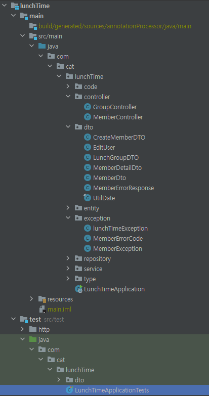

# 테스트란 무엇인가!
* [01. 테스트란 무엇인가? ](#테스트란)
* [02. ](#2)
* [03. ](#3)

##
### Reference  

[뒤로](README.md) / [위로](#컨탠츠-제목)

## 테스트란?

### 과거의 테스트란?
    테스트는 모두 사람이 하는 것이었고, 한번의 테스트는 상당한 노동력을 필요로 했다.
    SI에서는 전용 테스트 팀이 따로 있었고, 인수인계 전에 인수테스트라는 것을 진행해서 기능적인 테스트를 꼼꼼히 했었다.

### 테스트의 바람
    그러나...
    1. 로직이 대부분 쿼리에 있는 Mybatis에서는 테스트하기가 상당히 까다로웠다.
    2. 그 후 시간이 지나 JPA/Hibernate를 사용하게 되고 쿼리가 아닌 자바 코드에 로직이 많이 담기게 되었다.
        유지보수성의 극적인 향상(쿼리로는 다형성, 디자인패턴 전략등을 하기 어렵거나 불가능하다.)
        자바코드에 담긴 로직은 테스트하기가 쿼리에 담긴 로직에 비해 상대적으로 편리하다.

### TDD & 실무
    클래스의 구성이나 프로그램 구조가 잡히지 않은 상태에서는 어렵다.
    여러가지로 공부해보고 실무나 주변을 본 결과 완벽한 의미의 TDD(일단 테스트 먼저 짜고 코드를 만드는 것)은 어렵다.

### 테스트를 잘 하기 위한 기반
    1. 클래스나 메서드가 SRP를 잘 지키고, 크기가 적절히 작아야 함
        1-1. 테스트를 집중력 있게 만들 수 있고, 한 메서드에 너무 많은 테스트를 수행하지 않아도 됨.
        1-2. 이게 테스트를 하는것의 장점이 되기도 함(테스트를 하면 자연스럽게 역할이 확인되면서 쪼개짐_

    2. 적절한 Mocking을 통한 격리성 확보
        2-1. 단위테스트가 만능은 아니지만, 위의 SRP처럼 해당 메서드의 역할을 정확히 테스트하려면 주변 조건을 적절히 통제해야 한다.

    3. 당연히 잘 돌겠지라는 생각말고 꼼꼼히 테스트 && 과도하게 많은 테스트와 코드량이 생기지 않도록 적절히 끊기
        3-1. 테스트코드도 코드 리뷰 시에 적절한 테스르틀 하는지 확인 필요
        3-2. 중첩되지 않는 코드를 작성하기.

    4. 테스트 코드 개선을 위한 노력 필요
        4-1. 테스트코드도 리팩토링 필요
        4-2. 테스트코드의 기법들도 지속적인 고민 필요(통합테스트 등)
             외부 시스템등.. 

[뒤로](README.md) / [위로](#테스트란-무엇인가!)

## Junit and Mo

### JUnit5  
    자바의 UnitTest를 위한 프레임워크
    Spring Boot 2.4 버전부터는 JUnit 5 Only
    Ctrl + Shift + T를 누르면 동일한 구조로 Test 쪽에 만들어준다.
    순수하게 스프링을 위한 테스트 유닛은 아님!

[뒤로](README.md) / [위로](#컨탠츠-제목)

## 3
[뒤로](README.md) / [위로](#컨탠츠-제목)