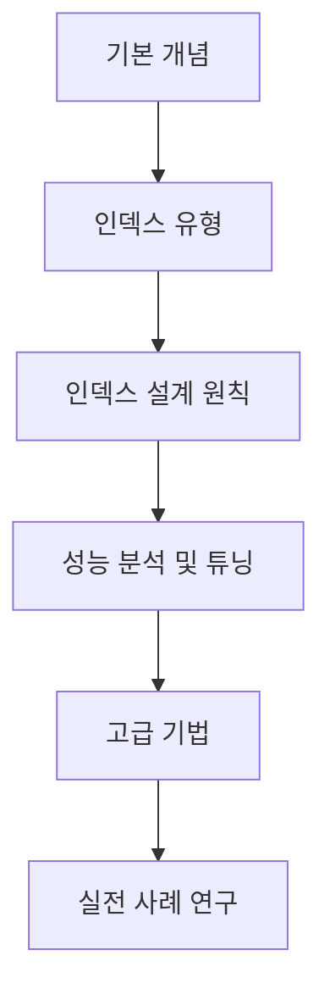

# 인덱스 설계
## 학습 로드맵 개요



## 인덱스 기본 개념

### #1: 인덱스의 기본 원리
- 인덱스의 정의와 목적
- B-Tree 구조와 작동 원리
- 인덱스가 쿼리 성능에 미치는 영향
- 실습: 간단한 테이블에 인덱스 생성 및 성능 비교

### #2: 카디널리티와 선택도
- 카디널리티의 정의와 중요성
- 선택도(Selectivity) 계산 방법
- 카디널리티가 인덱스 효율성에 미치는 영향
- 실습: 다양한 카디널리티를 가진 컬럼의 인덱스 성능 측정

### #3: 인덱스 스캔 유형
- 인덱스 풀 스캔 vs 테이블 풀 스캔
- 인덱스 범위 스캔(Index Range Scan)
- 인덱스 룩업(Index Lookup)
- 실습: EXPLAIN을 통한 다양한 스캔 유형 확인

## 인덱스 유형과 특성

### #4: 단일 컬럼 vs 복합 인덱스
- 단일 컬럼 인덱스의 특징과 사용 사례
- 복합(다중 컬럼) 인덱스의 작동 방식
- 인덱스 선행 컬럼 규칙
- 실습: 복합 인덱스 순서에 따른 성능 차이 측정

### #5: 특수 인덱스 유형
- 유니크 인덱스
- 함수 기반 인덱스
- 부분 인덱스(Partial Index)
- 비트맵 인덱스
- 실습: 각 인덱스 유형 생성 및 활용

### #6: 클러스터드 vs 논클러스터드 인덱스
- 클러스터드 인덱스의 특징과 장단점
- 논클러스터드 인덱스와의 차이점
- 인덱스 구성 전략
- 실습: 클러스터드/논클러스터드 인덱스 성능 비교

## 인덱스 설계 원칙

### #7: WHERE 절 최적화
- 검색 조건과 인덱스 활용
- 범위 검색과 인덱스 효율성
- 다중 조건 쿼리의 인덱스 전략
- 실습: WHERE 절 조건에 따른 인덱스 설계

### #8: ORDER BY와 GROUP BY 최적화
- 정렬 작업과 인덱스 활용
- GROUP BY 절에서의 인덱스 활용
- 인덱스를 통한 정렬 회피 전략
- 실습: 정렬 및 그룹화 쿼리 최적화

### #9: JOIN 연산과 인덱스
- 조인 유형별 인덱스 전략
- 외래 키 인덱싱의 중요성
- 조인 컬럼 인덱스 설계
- 실습: 다양한 조인 쿼리의 인덱스 최적화

## 성능 분석 및 튜닝

### #10: 실행 계획 분석
- EXPLAIN 명령어 심층 이해
- 실행 계획 해석 방법
- 인덱스 사용 여부 확인
- 실습: 다양한 쿼리의 실행 계획 분석

### #11: 인덱스 통계 및 히스토그램
- 인덱스 통계의 역할
- 히스토그램과 데이터 분포
- 통계 정보 업데이트 전략
- 실습: 통계 정보 갱신에 따른 실행 계획 변화 관찰

### #12: 인덱스 사용을 방해하는 요소
- 함수 적용된 컬럼
- 암시적 형변환
- OR 조건과 UNION
- 실습: 인덱스 사용을 방해하는 패턴 식별 및 개선

## 고급 인덱스 기법

### #13: 커버링 인덱스 전략
- 커버링 인덱스의 개념
- INCLUDE 구문 활용
- 인덱스 전용 스캔(Index-Only Scan)
- 실습: 커버링 인덱스 설계 및 성능 측정

### #14: 필터링된 인덱스와 부분 인덱스
- 특정 조건에 최적화된 인덱스 생성
- WHERE 조건을 포함한 인덱스
- 부분 인덱스의 활용 사례
- 실습: 필터링된 인덱스 생성 및 성능 비교

### #15: 인덱스 유지 관리
- 인덱스 단편화(Fragmentation)
- 인덱스 재구성(Rebuild)
- 사용되지 않는 인덱스 식별
- 실습: 인덱스 유지 관리 작업 수행

## 실전 사례 연구

### #16: OLTP 환경의 인덱스 전략
- 트랜잭션 처리 시스템의 특성
- 읽기/쓰기 비율에 따른 인덱스 전략
- 동시성과 인덱스 잠금
- 실습: OLTP 워크로드 시뮬레이션 및 인덱스 최적화

### #17: OLAP 환경의 인덱스 전략
- 분석 시스템의 특성
- 스타 스키마와 인덱싱
- 집계 쿼리 최적화
- 실습: OLAP 쿼리 패턴에 대한 인덱스 설계

### #18: 대용량 데이터베이스의 인덱스 전략
- 파티셔닝과 인덱스
- 분산 환경에서의 인덱스 전략
- 샤딩(Sharding)과 인덱스 설계
- 실습: 대용량 테이블의 인덱스 성능 분석

## 종합 프로젝트

### #19: 인덱스 설계 방법론
- 인덱스 설계 프로세스
- 워크로드 분석 기법
- 인덱스 우선순위 결정
- 실습: 전체 애플리케이션의 인덱스 전략 수립

### #20: 인덱스 성능 벤치마킹
- 벤치마킹 도구 소개
- 성능 측정 지표
- A/B 테스트 방법론
- 실습: 인덱스 변경에 따른 성능 벤치마킹

### #21: 실제 프로젝트 적용 및 회고
- 학습한 내용 종합 적용
- 인덱스 설계 체크리스트
- 성능 개선 사례 정리
- 실습: 실제 데이터베이스의 인덱스 분석 및 개선

## 각 항목 구성 템플릿

```markdown
# #[번호]: [주제]

## 📚 오늘의 학습 내용
- 핵심 개념 1
- 핵심 개념 2
- 핵심 개념 3

## 🔍 심층 탐구
[개념에 대한 자세한 설명]

## 💻 실습 코드
```sql
-- SQL 예제 코드
```

## 📊 성능 측정 결과
[실습 결과 및 분석]

## 🔗 참고 자료
- [참고 문서 1]
- [참고 문서 2]

## 💡 깨달은 점
[오늘의 학습을 통해 얻은 인사이트]
```

## 학습 자료 추천

### 책
1. **"High Performance MySQL"** - Baron Schwartz 외
2. **"SQL Performance Explained"** - Markus Winand
3. **"Database Internals"** - Alex Petrov

### 온라인 리소스
1. Use the Index, Luke! (https://use-the-index-luke.com/)
2. MySQL 공식 문서의 인덱스 섹션
3. PostgreSQL 인덱스 튜토리얼

### 실습 환경 구성
1. 로컬 데이터베이스 서버 설정
2. 샘플 데이터셋 준비 (예: Sakila, Northwind)
3. 성능 모니터링 도구 설치 (예: MySQL Workbench, pgAdmin)

---

### 기억해두면 좋은 영어 표현
- "Index design strategy" - 인덱스 설계 전략
- "Query execution plan analysis" - 쿼리 실행 계획 분석
- "Cardinality estimation" - 카디널리티 추정
- "Workload-based indexing" - 워크로드 기반 인덱싱

### 영어로 질문하기
영어로 이 질문을 하신다면:
"I'd like to create a structured learning plan for index design that I can document in my TIL (Today I Learned) entries. Could you help me design a comprehensive learning path?"
