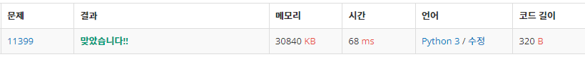
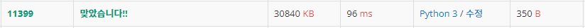

# 172_algorithm_theory
## 172_07_Greedy

### 그리드 알고리즘의 속도 자체는 그렇게 빠른편은 아님.

```python
human_number = int(input())
human_time_list = list(map(int , input().strip().split(" ")))
def Q_11399(human_number, human_time):
    human_time.sort()
    sum = 0
    i = 0
    for data in human_time:
        sum += data * (human_number - i)
        i += 1
    return(sum)

print(Q_11399(human_number, human_time_list))
```


```python
# 탐욕 알고리즘 사용 
human_number = int(input())
human_time_list = list(map(int, input().strip().split(" ")))
def Q_11399(human_number, human_time_list):
    human_time_list.sort()
    minimum = 0

    for i in range(human_number):
        for j in range(i + 1):
            minimum += human_time_list[j]
    return minimum
print(Q_11399(human_number, human_time_list))
```
