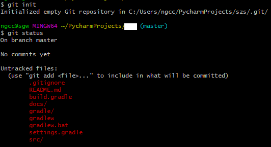
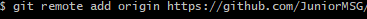
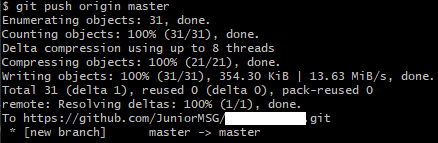

# 컨탠츠-제목
* [01.등록안된 프로젝트 등록하기](#1-프로젝트-등록하기)
* [02. ](#2)
* [03. ](#3)

### Reference  

[뒤로](../README.md) / [위로](#컨탠츠-제목)

## 1. 프로젝트 등록하기
### 프로젝트 등록에는 2가지 방법이 있다
    1. Repository를 만들고 해당 프로젝트를 Clone한 뒤 작성하는 방법
    2. Repository를 만들고 현재 프로젝트에 깃을 등록하고 프로젝트를 등록하는 방법 
    두 방법이 큰 차이는 없다. 

#### 1번 방법
    1. git clone https://github.com/JuniorMSG/~~~.git 
    2. 해당 폴더에 코드 붙여넣기
    3. git add .
    4. git commit -m 'Default Set'
    5. git push

#### 2번 방법
    1. Git bash에서 현재 프로젝트 경로로 이동한다.
    2. git init
    3. git remote add origin https://github.com/JuniorMSG/~~~.git
    4. git push origin master

   
  
   
 

[뒤로](../README.md) / [위로](#컨탠츠-제목)

